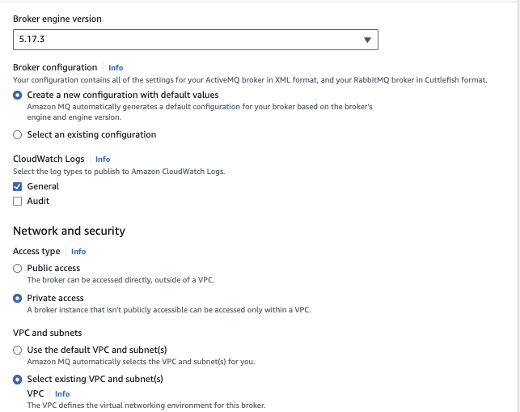

# Amazon MQ samples

This repository includes code and command to create Amazon MQ with different engine types.

## Active MQ

Active MQ is an OOS, multi-protocol, java based message broker. The Artemis version is supporting JMS 2.0. It supports message load balancing, HA. Multiple connected "master" brokers can dynamically respond to consumer demand by moving messages between the nodes in the background.

### Amazon MQ - Active MQ: creating via the console

The AWS console wizard is easy to get the brokers set up, and the most important elements of the configuration, is to select the type of deployment, the type of EC2 instance, product version, VPC, user credential, type of maintenance, logs.

For demonstration purpose, we can use a single-instance broker, on `mq.t3.micro` instance type.

For production we need to setup active/standby with shared persistence using Amazon EFS.

Here are some import screen shots for the configuration using AWS Console


Name and instance type:


Advanced setting, version, VPC, user to authenticate apps ...



To ensure that the broker is accessible within our VPC, we must enable the `enableDnsHostnames` and `enableDnsSupport` VPC attribute.


And add our host IP address to the security group on port 8162 (use https://whatismyipaddress.com/)

To allow Amazon MQ to publish logs to CloudWatch Logs, we must add a permission to our Amazon user and also configure a resource-based policy for Amazon MQ before creating or restarting the broker.

### Using AWS CLI

The `createBrokers.sh` script creates brockers using AWS CLI.

### Connection from client app

Once dpeloyed there are 5 differents end points to support the different protocols: AMQP, MQTT, OpenWire, STOMP and WSS. Amazon MQ doesn't support Mutual Transport Layer Security (TLS) authentication currently.

### To address

connection  - randomize=true
connection failure
broker failure - chaos testing
replicas
amqp client 
reactive messaging

### Code samples and local test

#### JMS


#### AMQP

The activeMQ folder includes AMQP clients based on the Quarkus guides for AMQP. In pure dev mode, quarkus starts AMQP broker automatically.

```sh
# in one terminal
mvn -f amqp-quickstart-producer quarkus:dev
# in a second terminal
mvn -f amqp-quickstart-processor quarkus:dev
```

Open http://localhost:8080/quotes.html in your browser and request some quotes by clicking the button.

With docker compose it uses ActiveMQ image.

```sh
mvn -f amqp-quickstart-producer clean package
mvn -f amqp-quickstart-processor clean package
```

* Deployment to ECR, and run on Fargate

## Rabbit MQ


## Interesting content to read

* [create broker AWS CLI command.](https://awscli.amazonaws.com/v2/documentation/api/latest/reference/mq/create-broker.html)

* [Amazon MQ CLI](https://github.com/antonwierenga/amazonmq-cli).