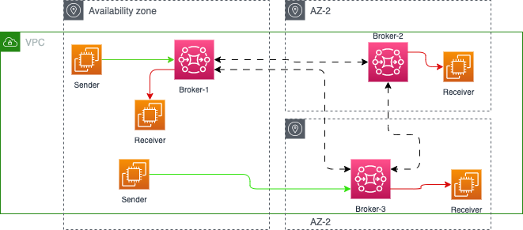

# Amazon MQ samples

This repository includes code and command to create Amazon MQ with different engine types.

## Active MQ

Active MQ is an OOS, multi-protocol, java based message broker. The Artemis version is supporting JMS 2.0. It supports message load balancing, HA. Multiple connected "master" brokers can dynamically respond to consumer demand by moving messages between the nodes in the background.

### Amazon MQ - Active MQ: creating via the console

The AWS console wizard is easy to get the brokers set up, and the most important elements of the configuration, is to select the type of deployment, the type of EC2 instance, product version, VPC, user credential, type of maintenance, logs.

For demonstration purpose, we can use a single-instance broker, on `mq.t3.micro` instance type.

For production we need to setup active/standby with shared persistence using Amazon EFS.

Here are some import screen shots for the configuration using AWS Console


Name and instance type:


Advanced setting, version, VPC, user to authenticate apps ...


To ensure that the broker is accessible within our VPC, we must enable the `enableDnsHostnames` and `enableDnsSupport` VPC attribute.


And add our host IP address to the security group on port 8162 (use https://whatismyipaddress.com/)

To allow Amazon MQ to publish logs to CloudWatch Logs, we must add a permission to our Amazon user and also configure a resource-based policy for Amazon MQ before creating or restarting the broker.

### Using AWS CLI

The `createBrokers.sh` script creates brockers using AWS CLI, and the [CLI product document](https://awscli.amazonaws.com/v2/documentation/api/latest/reference/mq/index.html) for parameter details.

### Connection from client app

Once dpeloyed there are 5 differents end points to support the different protocols: 

* OpenWire – ssl://xxxxxxx.xxx.com:61617
* AMQP – amqp+ssl:// xxxxxxx.xxx.com:5671
* STOMP – stomp+ssl:// xxxxxxx.xxx.com:61614
* MQTT – mqtt+ssl:// xxxxxxx.xxx.com:8883
* WSS – wss:// xxxxxxx.xxx.com:61619

Amazon MQ doesn't support Mutual Transport Layer Security (TLS) authentication currently.

In active/standby deployment, any one of the brokers can be active at a time. Any client connecting to a broker uses a failover string that defines each broker that the client can connect to send or receive messages.

```sh
failover:(ssl://b-9f..7ac-1.mq.eu-west-2.amazonaws.com:61617,ssl://b-9f...c-2.mq.eu-west-2.amazonaws.com:61617)
```

Adding failover in broker url ensures that whenever server goes up, it will reconnect it immediately.

> "Network mapping"
    Each of those failover URL are in fact mapped to IP@ of ENI. Each broker node has two [ENI connected](https://docs.aws.amazon.com/amazon-mq/latest/developer-guide/connecting-to-amazon-mq.html) to tow different network. The `b-9f...-1` is mapped to 10.42.1.29 for example on subnet 1, while `b-9f...-2` is 10.42.0.92 to subnet 0.

When the active broker reboot, the client applications may report issue but reconnect to the backup broker:

```
Transport: ssl://b-d....-2.mq.us-west-2.amazonaws.com/10.42.0.113:61617] WARN org.apache.activemq.transport.failover.FailoverTransport - Transport (ssl://b-d...-2.mq.us-west-2.amazonaws.com:61617) failed , attempting to automatically reconnect: {}
java.io.EOFException
        at java.base/java.io.DataInputStream.readInt(DataInputStream.java:397)
    ...

[ActiveMQ Task-3] INFO org.apache.activemq.transport.failover.FailoverTransport - Successfully reconnected to ssl://b-d...-1.mq.us-west-2.amazonaws.com:61617
```

In the context of cluster mesh, each application may use different failover URL to different brokers



One sender can have the following URL configuration:

```sh
failover:(ssl://b-650....e-1.mq.us-west-2.amazonaws.com:61617,ssl://b-650...e-2.mq.us-west-2.amazonaws.com:61617)
```

and consumer with url:

```
failover:(ssl://b-9f69...f-1.mq.us-west-2.amazonaws.com:61617,ssl://b-9f69...f-2.mq.us-west-2.amazonaws.com:61617)
```

The networkConnector in each broker configuration links each broker per pair, and messages flow between brokers using `networkConnectors` only when a consumer demands them. The messages do not flow to other brokers if no consumer is available.

### To address

connection  - randomize=true
connection failure
broker failure - chaos testing
replicas
amqp client 
reactive messaging

### Server configuration HA and Failover

The [Artemis product documentation HA chapter](https://activemq.apache.org/components/artemis/documentation/) gives all the detail on the different topology. Here are the important points

* Use Live/backup groups.
* A backup server is owned by only one live server.
* Two strategies for backing up a server **shared store** and **replication**.
* Only persistent message data will survive failover
* With **replication** the data filesystem is not shared, but replicated from live to standby.  At start-up the backup server will first need to synchronize all existing data from the live server, which brings lag. This could be minimized.
* With replicas when live broker restarts, and failback it will replicate data from the backup broker more fresh messages.
* Brokers with replication are part of a cluster. So broker.xml needs to include cluster connection. Live | backup brokers are in the same node-group.
* When using a **shared store**, both live and backup servers share the same entire data directory using a **shared file system** (SAN).

To test the failover start the active/passive brokers, and uses two different broker configuration in `config` folder. 

```sh
docker compose -f mq-act-stby-docker-compose.yml up -d
# the container names include active and passive
```


### Code samples and local test

In development mode we can use docker to run one artemis broker. Start with `docker compose -f artemis-docker-compose.yaml up -d`, and then the different `quarkus dev` under each producer or consumer folder.

We can validate the console at: [http://localhost:8161/console](http://localhost:8161/).

We can also test within the docker image:

```sh
docker exec artemis /home/jboss/broker/bin/artemis producer --destination demoqueue   --message-size 1024 --message-count 10
# in another terminal
docker exec artemis /home/jboss/broker/bin/artemis consumer --destination demoqueue   --message-count 10 --verbose

```


#### JMS point to point one way sample

Once the two docker images for jms-producer and jms-consumer are built, using

```sh
# under jms-producer
./buildAll
# jms-consumer
./buildAll 
```

start the jms docker compose

```sh
docker compose -f jms-docker-compose.yml up -d
```

and use the Producer REST API to send n messages. [Producer API](http://localhost:8081/q/swagger-ui), the consumer should get the messages in the logs (`docker logs consumer`).

#### JMS request-reply

The code is under [jms-orchestrator](./activeMQ/jms-orchestrator/) and [jms-participant](./activeMQ/jms-participant), to implement a request-response over queue using JMS. This code use client acknowledgement, and replyTo queue. It does not use CDI for bean injection but code base instantiation of the ConnectionFactor. The docker compose also define a Active / Standby Active MQ nodes. 

#### AMQP

The activeMQ folder includes AMQP clients based on the Quarkus guides for AMQP. In pure dev mode, quarkus starts AMQP broker automatically.

```sh
# in one terminal
mvn -f amqp-quickstart-producer quarkus:dev
# in a second terminal
mvn -f amqp-quickstart-processor quarkus:dev
```

Open http://localhost:8080/quotes.html in your browser and request some quotes by clicking the button.

With docker compose it uses ActiveMQ image.

```sh
mvn -f amqp-quickstart-producer clean package
mvn -f amqp-quickstart-processor clean package
```

* Deployment to ECR, and run on Fargate

## Rabbit MQ


## Interesting content to read

* [create broker AWS CLI command.](https://awscli.amazonaws.com/v2/documentation/api/latest/reference/mq/create-broker.html)

* [Amazon MQ CLI](https://github.com/antonwierenga/amazonmq-cli).
* [Implementing enterprise integration patterns with AWS messaging services: point-to-point channels.](https://aws.amazon.com/blogs/compute/implementing-enterprise-integration-patterns-with-aws-messaging-services-point-to-point-channels/)