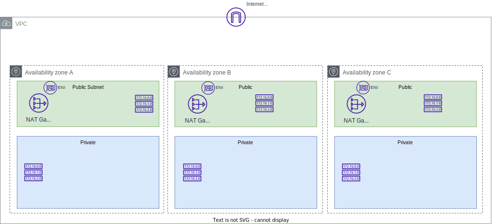

# Deploy ActiveMQ with AWS CDK

!!! Info
    Created 09/2023 - Updated 10/22/23

## Common Stack

The first stack is used to define a VPC with 3 AZs, 3 public subnets, 3 private subnets, 3 NAT gateways, routes, and Network load balancer which should match the following diagram:



To create the stack see the `IaC-common` folder and use cdk CLI.

```sh
# under IaC-common folder
cdk synth
cdk deploy --all
```

Here are the resource created:

* One internet gateway, 3 NAT gateways, one in each in public subnet. Each NAT gateway has a Elastic Network Interface with public and private IP addresses.
* 3 route tables, one in each public subnet and one in each private subnet
* 3 route tables for the private subnet, that have egress route to NAT
* Security groups
* IAM role for the lambda function to assume, so it can update security groups in VPC
* Lambda function for removing all inbound/outbound rules from the VPC default security group
* Cloud 9 environment

## Active MQ Active/Standby

To deploy an Amazon MQ - Active MQ with active and standby deployment use the stack under [amazonMQ/activeMQ/IaC]()