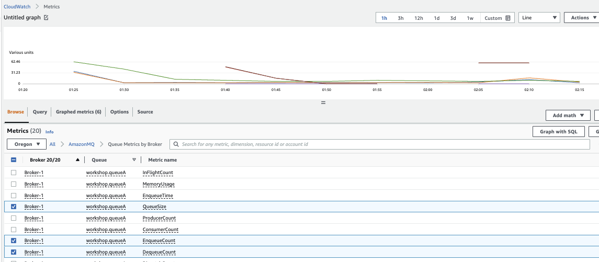
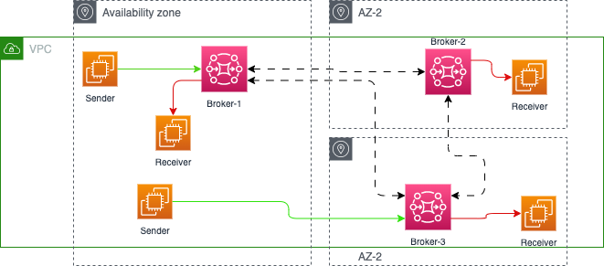
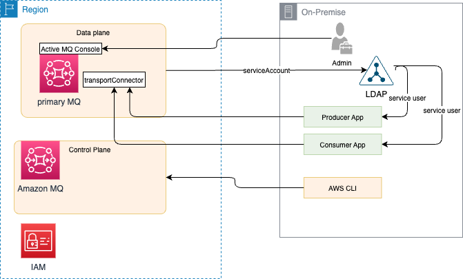

# Active MQ & Amazon MQ 

This section is a quick summary from [ActiveMQ Artemis version product documentation](https://activemq.apache.org/components/artemis/documentation/), ActiveMQ [classic documentation](https://activemq.apache.org/components/classic/documentation) and Amazon MQ [ActiveMQ engine documentation](https://docs.aws.amazon.com/amazon-mq/latest/developer-guide/working-with-activemq.html) for Active MQ 5.17.3 deployment as a managed service.

## [The Open Source project](https://activemq.apache.org/)

Active MQ is an Open Source software, multi-protocol, java based message broker. ActiveMQ has two main version of the product Active MQ 5.x (or classic) and Artemis 2.x which supports Jakarta Messsaging 3.1. It also supports embedding the broker in a java app.

It supports message load balancing, HA. Multiple connected "master" brokers can dynamically respond to consumer demand by moving messages between the nodes in the background.

Amazon MQ - Active MQ engine supports the Classic version.

Active MQ supports different messaging patterns: **queue** and **topic**:

* Queue supports point to point, and request/replyTo pattern.
* Queue can have multiple senders and consumers, the message will be load balanced between consumers. Messages acknowledged are removed from the queue.
* Message with a TTL will be removed from queue, without being consumed.


* Topic supports pub/sub.
* With Topic, receiver starts to receive only the new messages, that are being sent by the sender. Messages sent to topic without consumer are lost.
* Topics support the fan-out pattern. All Messages sent by any senders are received by all connected receivers.


### Value propositions

* Java 11+, JMS 2.0, Jakarta Messaging 3.0
* [Protocols](https://activemq.apache.org/protocols) supported: STOMP, AMQP, [OpenWire](https://activemq.apache.org/wire-protocol), MQTT, NMS (.Net), CMS (C++),  HornetQ, core Artemis API.
* Support Queues and Topics for pub/sub
* Performance with message persistence.
* Integrated with Java EE application server or embbeded in a java app, or standalone using lightweight netty server.
* HA solution with automatic client failover
* Flexible clustering
* Messages can be ordered by message group
* Message filtering using selectors to perform content based routing
* Unlimited message size so there is not need to plan for unexpected messages
* Message Delay and scheduling
* Distribute transactions to manage complex multi stage transactions such as database access
* Virtual Topics and composite destinations
* Complex redelivery policy


### Configurations

A configuration contains all of the settings for the ActiveMQ brokers, in XML format. 

It is possible to configure users and groups, and then the `authorizationMap` so a specific queue or topic can only be accessed by a specific user/app (The declaration below, allows user1 to manage, write and read from `queue.user1`, but not user2, who is allowed admin, read and write on `topic.user2`): 

```xml
<authorizationPlugin>
    <map>
    <authorizationMap>
        <authorizationEntries>
          <authorizationEntry admin="admin,activemq-webconsole" queue="&gt;" read="admin,activemq-webconsole" write="admin,activemq-webconsole"/>
          <authorizationEntry admin="admin,activemq-webconsole" topic="&gt;" read="admin,activemq-webconsole" write="admin,activemq-webconsole"/>
          <authorizationEntry admin="admin,user1" queue="queue.user1" read="user1" write="user1"/>
          <authorizationEntry admin="admin,user2" read="user2" topic="topic.user2" write="user2"/>
          <authorizationEntry admin="admin,user1,user2" read="admin,user1,user2" topic="ActiveMQ.Advisory.&gt;" write="admin,user1,user2"/>
        </authorizationEntries>
        <tempDestinationAuthorizationEntry>
        <tempDestinationAuthorizationEntry admin="tempDestinationAdmins" read="tempDestinationAdmins" write="tempDestinationAdmins"/>
        </tempDestinationAuthorizationEntry>
    </authorizationMap>
    </map>
</authorizationPlugin>
```

In order to apply the modifications done to the broker configuration, the broker must be rebooted. A reboot can be scheduled, and use specific configuration revision to specify which configuration updates to apply.

## [Amazon MQ](https://docs.aws.amazon.com/amazon-mq/latest/developer-guide/welcome.html)

Amazon MQ is a managed message broker for RabbitMQ or ActiveMQ. It runs on EC2 servers, and supports multi-AZs deployment with failover.

We can create brokers via Console ([see this lab](labs/aq-aws-console-lab.md)), using the AWS CLI, SDK or CDK.

As a queueing system, when a message is received and acknowledged by one receiver, it is no longer on the queue, and the next receiver to connect gets the next message on the queue.

Multiple senders can send messages to the same queue, and multiple receivers can receive messages from the same queue. But each message is only delivered to one receiver only.

With topics, a consumer gets messages from when it starts to consume, previous messages will not be seen. Multiple subscribers will get the same message. All the messages sent to the topic, from any sender, are delivered to all receivers.

The Amazon MQ Configuration is a specific object to manage the configuration of the broker. It can be created before the broker and supports Active MQ [activemq.xml configuration.](https://docs.aws.amazon.com/amazon-mq/latest/developer-guide/amazon-mq-broker-configuration-parameters.html)

### Amazon MQ value propositions

* Keep skill investment and code compatibility with existing on-premises applications.
* Reduce cost.
* Deployment automation with CloudFormation, deploy in minutes.
* Reduced operation overhead, including provisioning, updates, monitoring, maintenance, security and troubleshooting.
* Vertical scaling with EC2 instance size and type.
* Horizontal scaling through network of brokers.
* Queues and topics are in one service so we can easily fan out or build durable queue.
* Both Transient and persistent messages are supported to optimize for durability or performance.
* Lower latency.
* Support Lift and shift of existing apps to the cloud, or use an hybrid architecture.

### Performance considerations

* The size of the message determines performance of the broker, above 100k, storage throughput is a limiting factor.
* With in-memory queue without persistence, Active MQ can reach high throughput. With no message lost goal, it uses persistence with flush at each message, and it will be bound by the I/O capacity of the underlying persistence store, EBS or EFS. `mq.m5.large`.
* To improve throughput with Amazon MQ, make sure to have consumers processing messaging as fast as, or faster than the producers are pushing messages.
* With EFS replication, with cluster and HA, throughput will be lower.
* [Blog: "Measuring the throughput for Amazon MQ using the JMS Benchmark".](https://aws.amazon.com/blogs/compute/measuring-the-throughput-for-amazon-mq-using-the-jms-benchmark/)  


### Amazon MQ [Pricing](https://aws.amazon.com/amazon-mq/pricing/)

We pay by the hour of broker time according to the type of EC2 used as broker. The topology also impacts pricing between single, active/standby and cluster.

Storage price is based on GB persisted on EFS in case of cluster, or EBS in case of single instance.

Data transfer pricing applies too:

* For Traffic forwarded between brokers across availability zones in the same region
* For Traffic cross-region based on EC2 pricing. In region is not charged.
* For traffic out to the internet.

### Amazon MQ Monitoring

AmazonMQ publishes [utilization metrics for the brokers](https://docs.aws.amazon.com/amazon-mq/latest/developer-guide/security-logging-monitoring.html), such as `CpuUtilization, HeapUsage, NetworkOut`. If we have a configuration with a primary and a secondary broker, we will have independent metrics for each instance.

It also publishes metrics for queues and Topics such as `MemoryUsage, EnqueueCount` (messages published by producers), `DispatchCount` (message delivered to consumers).

{ width=900 }

**Figure 1: Queue monitoring with metrics**

Using Cloudwatch alarm we can auto scale the consumer based on metrics value.

From the AWS Amazon MQ Broker console, we can access to the Active MQ console and see the queues.

{ width=800 }

**Figure 2: Active MQ admin console**

See the [monitoring Lab](./labs/activemq-monitoring.md) for JMX local management, and Amazon MQ monitoring.

### Maintenance

AWS is responsible of the hardware, OS, engine software update. Maintenance may be scheduled once a week and can take up to 2 hours. Automatic maintenance can be enforced for minor version upgrade.

## Active MQ Topologies

The [Artemis product documentation HA chapter](https://activemq.apache.org/components/artemis/documentation/) gives all the details on the different topologies supported. Here are the important points to remember:

* Use Live/backup node groups when more than two brokers are used.
* A backup server is owned by only one live server.
* Two strategies for backing up a server **shared store** and **replication**.
* When using a **shared store**, both live and backup servers share the same entire data directory using a **shared file system** (SAN).

    

    **Figure 3: Active/standby shared storage**

* Only persistent message data will survive failover.
* With **replication** the data filesystem is not shared, but replicated from live to standby.  At start-up the backup server will first need to synchronize all existing data from the live server, which brings lag. This could be minimized.

    

    **Figure 4: Active/standby replicate storage**

* With replicas when live broker restarts and failbacks, it will replicate data from the backup broker with the most fresh messages.
* Brokers with replication are part of a cluster. So `broker.xml` needs to include cluster connection. Live | backup brokers are in the same node-group.


### Active Standby

Active / Standby topology uses a pair of brokers in different Availability Zones. One broker gets all the connection and traffic, the other is in standby, ready to take the traffic in case of failure of the active broker. The persistence is supported by a Storage Area Network.


**Figure 5: Amazon MQ - Active/standby shared storage**

Amazon [Elastic File System](https://docs.aws.amazon.com/efs/latest/ug/whatisefs.html) is the serverless file system used to persist messages. We can mount the EFS file systems on on-premises data center servers when connected to the Amazon VPC with AWS Direct Connect or AWS VPN.

For an active/standby broker, Amazon MQ provides two ActiveMQ Web Console URLs, but only one URL is active at a time.

#### Hybrid cloud with AWS

* During migration to the cloud, we need to support hybrid deployment where existing applications on-premises consume messages from queues or topics defined in Amazon MQ - Active MQ engine. The following diagram illustrates different possible integrations and the deployment of active/standby brokers in 2 availability zones.

    

    **Figure 6: Hybrid integration with Amazon MQ**

    * The on-premises applications or ETL jobs access the active broker, using public internet or private connection with Amazon Direct Connect, or site-to-site VPN.
    * For the public access, the internet gateway routes the traffic to a network load balancer (layer 4 TCP routing), which is also HA (not represented in the figure), to reach the active Broker.
    * The public internet traffic back from the Active MQ queue or topic to the consumer is via a NAT gateway. NAT gateways are defined in both public subnets for HA.
    * When using private gateways, the VPC route tables includes routes to the CIDR of the on-premises subnets.
    * Security group defines firewall like policies to authorize inbound and outbound traffic. The port for Active MQ needs to be open. Below is such declaration:
    * EFS is used as a shared file system for messages persistence.
    * The standby broker is linked to the active broker and ready to take the lead in case of active broker failure.
    * For higher bandwidth and secured connection, Direct Connect should be used and then the communication will be via private gateway end point.
    * Lambda function may be used to do light processing like data transformation, or data enrichment and then to call directly SaaS services. When more complex flow, like stateful flows, are needed, Amazon Step function can also be used (also serverless).

### Mesh

We can choose a network of brokers with multiple active/standby brokers, like a broker Mesh. This topology is used to increase the number of client applications. Any one of the two Active/Stanby brokers can be active at a time with messages stored in a **shared durable storage**.. There is no single point of failure as in client/server or hub and spoke topologies. A client can failover another broker improving high availability. 

The following diagram illustrates a configuration over 3 AZs, and the corresponding [CloudFormation template can be found here](https://s3.amazonaws.com/amazon-mq-workshop/CreateAmazonMQWorkshop.yaml).



**Figure 7: Amazon MQ cluster deployment**

Each broker can accept connections from clients. The client endpoints are named `TransportConnectors`. Any client connecting to a broker uses a failover string that defines each broker that the client can connect to send or receive messages.

```sh
amqp+ssl://b-5......87c1e-1.mq.us-west-2.amazonaws.com:5671
amqp+ssl://b-5......87c1e-2.mq.us-west-2.amazonaws.com:5671
```

In order to scale, client connections can be divided across brokers. 

Because those brokers are all connected using network connectors, when a producer sends messages to say NoB1, the messages can be consumed from NoB2 or from NoB3. This is because `conduitSubscriptions` is set to false.

Essentially we send messages to any brokers, and the messages can still be read from a different brokers.

Amazon MQ proposes a mesh network of single-instance brokers with non shated files as each broker uses EBS volume.


**Figure 8: Amazon MQ broker mesh cluster deployment**

Brokers are connected with each other using `OpenWire` network connectors. Within each broker configuration, for each queue and topic, there are a set of `networkConnector` items defining connection from the current broker and to the two other brokers in the mesh. So each broker has a different networkConnector, to pair to each other broker.

```xml
  <networkConnectors>
    <networkConnector conduitSubscriptions="false" consumerTTL="1" messageTTL="-1" name="QueueConnector_ConnectingBroker_1_To_2" uri="masterslave:(ssl://b-c2....2-1.mq.us-west-2.amazonaws.com:61617,ssl://b-c2...2-2.mq.us-west-2.amazonaws.com:61617)" userName="mqadmin">
      <excludedDestinations>
        <topic physicalName="&gt;"/>
      </excludedDestinations>
    </networkConnector>
    <networkConnector conduitSubscriptions="false" consumerTTL="1" messageTTL="-1" name="QueueConnector_ConnectingBroker_1_To_3" uri="masterslave:(ssl://b-ad...647-1.mq.us-west-2.amazonaws.com:61617,ssl://b-ad...d747-2.mq.us-west-2.amazonaws.com:61617)" userName="mqadmin">
      <excludedDestinations>
        <topic physicalName="&gt;"/>
      </excludedDestinations>
    </networkConnector>
```

The messages do not flow to other brokers if no consumer is available.

The duplex attribute on `networkConnector` essentially establishes a two-way connection on the same port. This would be useful when network connections are traversing a firewall and is common in *Hub and Spoke* broker topology. In a Mesh topology, it is recommended to use explicit unidirectional networkConnector as it allows flexibility to include or exclude destinations.

Because these brokers are all connected using network connectors, when a producer sends messages to say NoB1, the messages can be consumed from NoB2 or from NoB3.


### Hub and Spoke

For Hub and Spoke a central broker dispatches to other connected broker.


## Active MQ as Amazon MQ Engine

In the Amazon MQ, the primary AWS resources are the Amazon MQ message broker and its configuration. The broker can be deployed in SINGLE_INSTANCE, ACTIVE_STANDBY_MULTI_AZ, or CLUSTER_MULTI_AZ. The configuration can be done [via the AWS console](./labs/aq-aws-console-lab.md), AWS CLI, Cloud Formation or [CDK](./labs/activemq-cdk.md)

### Security considerations

Active MQ is coming with its own way to define access control to Queue, Topics and Brokers. 

* Access to AWS Console and Specific engine console to administrators.
* Encryption in transit via TLS.
* Encryption at rest using KMS: when creating the broker, we can select the KMS key to use to encrypt data.
* VPC support for brokers isolation and applications isolation.
* Security groups for firewall based rules.
* Queue/topic authentication and authorization using Configuration declarations.
* Integrated with CloudTrail for Amazon MQ API auditing.
* User accesses can be defined in an external LDAP, used for management Console access or for service accounts. Apps identifications are done inside the broker configuration.

Amazon MQ uses IAM for creating, updating, and deleting operations on the message broker or configuration, and native ActiveMQ authentication for connection to brokers. The following figure illustrates those security contexts:


We define three users: 

1. An **IAM administrator** who manages security within an AWS account, specifically IAM users, roles and security policies. This administrator has full access to CloudWatch logs and CloudTrail for API usage auditing. The IAM policy uses action on "mq:" prefix, and possible resources are `broker` and `configuration`. 
1. An **MQ service administrator**, manages the MQ brokers and configuration via the AWS Console, AWS CLI or APIs. This administrator should be able to define brokers and configurations, networking access controls, security groups, and may be anything related to consumer and producer apps. He/she should have access to CloudWatch Logs and CloudTrail logs too. An administrator needs to signin to amazon api and get the [permissions to act on the broker](https://docs.aws.amazon.com/amazon-mq/latest/developer-guide/security-api-authentication-authorization.html#security-permissions-required-to-create-broker) and the underlying EC2 instances.
1. Developer defining queue, topics, and get broker URL and credentials. Developer users can be defined in external active directory or in broker configuration file.

Amazon MQ management operations like creating, updating and deleting brokers require IAM credentials and are not integrated with LDAP.

As the Amazon MQ control plane will do operations on other AWS services, there is a service-linked role (`AWSServiceRoleForAmazonMQ`) defined automatically when we define a broker, with the security policies ([AmazonMQServiceRolePolicy](https://console.aws.amazon.com/iam/home#policies/arn:aws:iam::aws:policy/aws-service-role/AmazonMQServiceRolePolicy)) to get the brokers deployed. A service-linked role is a unique type of IAM role that is linked directly to Amazon MQ.


Amazon MQ uses ActiveMQ's Simple Authentication Plugin to restrict reading and writing to destinations. See [this product documentation](https://docs.aws.amazon.com/amazon-mq/latest/developer-guide/security-authentication-authorization.html) for details.

#### LDAP integration

* The LDAP integration is done via [ActiveMQ JAAS plugin](https://activemq.apache.org/security).

    

* A service account, defined in LDAP, is required to initiate a connection to an LDAP server. It sets up LDAP authentication for the brokers. Client connections are authenticated through this broker-LDAP connection.
* The on-premises LDAP server needs a DNS name, and be opened on port 636.
* When creating broker, we can specify the LDAP login configuration with User Base distinguished name, search filter, role base DN, role base search filter. The user base supplied to the ActiveMQ broker must point to the node in the Directory Information Tree where users are stored in the LDAP server.

As illustrated in figure above, we have to assess the different use cases:

1. A user accessing the MQ console, the authentication to the broker console will go to the LDAP server
1. Applications, producers or consumers, accessing the broker using the transport Connector URL, and authenticate via a service user defined in LDAP.
1. An administrator users access Amazon MQ control plane via API, using AWS CLI, to create brokers, configurations. This user needs to be part of the `amazonmq-console-admins` group.

For user authentication via LDAP we need to define the connection to LDAP in the broker configuration file, which also includes where to search the JMS topic and queue information in the DIT:

```xml
<plugins>
    <jaasAuthenticationPlugin configuration="LdapConfiguration" /> 
    <authorizationPlugin> 
     <map> 
       <cachedLDAPAuthorizationMap
            queueSearchBase="ou=Queue,ou=Destination,ou=ActiveMQ,dc=systems,dc=anycompany,dc=com"
            topicSearchBase="ou=Topic,ou=Destination,ou=ActiveMQ,dc=systems,dc=anycompany,dc=com"
            tempSearchBase="ou=Temp,ou=Destination,ou=ActiveMQ,dc=systems,dc=anycompany,dc=com"
            refreshInterval="300000"
            legacyGroupMapping="false"
        />
         ...
```

* Authorization is done on a per-destination basis (or wildcard, destination set) via the `cachedLdapAuthorizationMap` element, found in the broker’s `activemq.xml`. See [Amazon MQ product doc](https://docs.aws.amazon.com/amazon-mq/latest/developer-guide/security-authentication-authorization.html) for xml examples and [Active MQ doc with OpenLDAP example](https://activemq.apache.org/cached-ldap-authorization-module).
* In LDAP, we can define topics and queues in a Destination OU like: `dn: cn=carrides,ou=Queue,ou=Destination,ou=ActiveMQ,ou=systems,dc=anycompany,dc=com`, within those OU, either a wildcard or specific destination name can be provided (OU=ORDERS.$). Within each OU that represents a destination or a wildcard, we must create three security groups: admin, write, read, to include users or groups who have permission to perform the associated actions.

```ldif
dn: cn=admin,cn=carrides,ou=Queue,ou=Destination,ou=ActiveMQ,ou=systems,dc=anycompany,dc=com 
cn: admin 
description: Admin privilege group, members are roles 
member: cn=admin 
member: cn=webapp 
objectClass: groupOfNames 
objectClass: top 
```

Adding a user to the admin security group for a particular destination will enable the user to create and delete that queue or topic.


#### Connection from client app

Once deployed there are 5 differents end points to support the different protocols:

* OpenWire – ssl://xxxxxxx.xxx.com:61617
* AMQP – amqp+ssl:// xxxxxxx.xxx.com:5671
* STOMP – stomp+ssl:// xxxxxxx.xxx.com:61614
* MQTT – mqtt+ssl:// xxxxxxx.xxx.com:8883
* WSS – wss:// xxxxxxx.xxx.com:61619

As of Dec 2023, Amazon MQ doesn't support Mutual Transport Layer Security (mTLS) authentication.

In active/standby deployment, any one of the brokers can be active at a time. Any client connecting to a broker uses a failover string that defines each broker that the client can connect to.

```sh
failover:(ssl://b-9f..7ac-1.mq.eu-west-2.amazonaws.com:61617,ssl://b-9f...c-2.mq.eu-west-2.amazonaws.com:61617)
```

Adding failover in broker url ensures that whenever server goes up, it will reconnect it immediately. [See Active MQ documentation on failover](https://activemq.apache.org/failover-transport-reference.html)

??? info "Network mapping"
    On AWS, each of those failover URL are in fact mapped to IP@ of a ENI. Each broker node has two [ENIs connected](https://docs.aws.amazon.com/amazon-mq/latest/developer-guide/connecting-to-amazon-mq.html) to two different networks. The `b-9f...-1` is mapped to 10.42.1.29 for example on subnet 1, while `b-9f...-2` is 10.42.0.92 to subnet 0.

When the active broker reboots, the client applications may report issue but reconnect to the backup broker. Below is an example of logs:

```sh
Transport: ssl://b-d....-2.mq.us-west-2.amazonaws.com/10.42.0.113:61617] WARN org.apache.activemq.transport.failover.FailoverTransport - Transport (ssl://b-d...-2.mq.us-west-2.amazonaws.com:61617) failed , attempting to automatically reconnect: {}
java.io.EOFException
        at java.base/java.io.DataInputStream.readInt(DataInputStream.java:397)
    ...

[ActiveMQ Task-3] INFO org.apache.activemq.transport.failover.FailoverTransport - Successfully reconnected to ssl://b-d...-1.mq.us-west-2.amazonaws.com:61617
```

In the context of cluster mesh, each application may use different failover URL to connect to different brokers.

One sender can have the following URL configuration:

```sh
failover:(ssl://b-650....e-1.mq.us-west-2.amazonaws.com:61617,ssl://b-650...e-2.mq.us-west-2.amazonaws.com:61617)
```

and one consumer with the url:

```sh
failover:(ssl://b-9f69...f-1.mq.us-west-2.amazonaws.com:61617,ssl://b-9f69...f-2.mq.us-west-2.amazonaws.com:61617)
```

The networkConnector in each broker configuration links each broker per pair, and messages flow between brokers using `networkConnectors` only when a consumer demands them. The messages do not flow to other brokers if no consumer is available.


## Storage

The [ActiveMQ message storage](https://activemq.apache.org/amq-message-store) is an embeddable transactional message storage solution. It uses a transaction journal to support recovery. Messages are persisted in data logs (up to 32mb size) with reference to file location saved in [KahaDB](https://activemq.apache.org/kahadb.html), in memory. Messages are in memory and then periodically inserted in the storage in the frequency of `checkpointInterval` ms. Version 5.14.0 introduces journal synch to disk strategy: `always` ensures every journal write is followed by a disk sync (JMS durability requirement). 

Message data logs includes messages/acks and transactional boundaries.
Be sure to have the individual file size greater than the expected largest message size.

Also broker who starts to have memory issue, will throttle the producer or even block it. See [this Producer flow control article](https://activemq.apache.org/producer-flow-control.html) for deeper explanation and configuration per queue.

Messages can be archived into separate logs.

See [the product documentation for persistence configuration.](https://activemq.apache.org/amq-message-store)


## FAQs

Most of those questions are related to the Open source version, but some to Amazon MQ deploymento of Active MQ.

???- question "What needs to be done to migrate to Artemis"
    As of today Amazon MQ, Active MQ supports only Classic deployment and API. Moving to Artemis, means deploying on your own EC2 instances. Most of the JMS code will work or with minimum refactoring for the connection factory. The project dependencies need to be changed, the ActiveMQ connection factory class is different in term of package names, and if you use Jakarta JMS then package needs to be changed in the JMS producer and consumer classes.

???- question "What are the CLI commands that can be run on Amazon MQ?"
    See [this list](https://awscli.amazonaws.com/v2/documentation/api/latest/reference/mq/index.html). To run those we need a user or an IAM role with `mq:` actions allowed. 

???- question "How to create queue or resources?"
    With open source Active MQ, we can use JMS API as they can be created dynamically via code, and using JMX. Static definitions can be done in the broker.xml file:
    
    ```
    ```
    
    Amazon MQ does not support JMX access, so queue needs to be created using code.

???- question "What is the advantage of replicas vs shared storage?"
    Shared storage needs to get SAN replication to ensure DR at the storage level. If not the broker file system is a single point of failure. It adds cost to the solution but it performs better. Replicas is ActiveMQ integrate solution to ensure High availability and sharing data between brokers. Slave broker copies data from Master. States of the brokers are not exchanged with replicas, only messages are. For Classic, JDBC message store could be used. Database replication is then used for DR. When non durable queue or topic are networked, with failure, inflight messages may be lost.

???- question "What is the difference between URL failover and implementing an ExceptionListener?"
    Java Messaging Service  has no specification on failover for JMS provider. When broker fails, there will be a connection Exception. The way to manage this exception is to use the asynchronous `ExceptionListener` interface which will give developer maximum control over when to reconnect, assessing what type of JMS error to better act on the error. ActiveMQ offers the failover transport protocol, is for connection failure, and let the client app to reconnect to another broker as part of the URL declaration. Sending message to the broker will be blocked until the connection is restored. Use `TransportListener` interface to understand what is happening. This is a good way to add logging to the application to report on the connection state.

???- question "what are the critical metrics / log patterns that should be monitored in respect to MQ logs?"
    Amazon CloudWatch metrics has a specific Amazon MQ dashboard with CpuUtilization, CurrentConnectionCount, networking in/ou, producer and consumer counts. We can add our own metrics using the broker or queue specific ones. The following may be of interest for storage: (See [this re:post](https://repost.aws/knowledge-center/mq-persistent-store-is-full-errors)):
        
    * Store Percentage Usage
    * Journal Files for Full Recovery: # of journal files that are replayed after a clean shutdown.
    * Journal Files for Fast Recovery: same but for unclean shutdown. (too many pending messages in storage)

    When broker starts to have memory limit for a destination, then producer flow will be throttled, even blocked. (See [this note](https://activemq.apache.org/producer-flow-control.html))
    

???- question "When messages are moved to DLQ?"
    Producer app can set `setTimeToLive` with millisecond parameter. When the message has not being delivered to consumer, ActiveMQ move it to an expiry address, which could be mapped to a dead-letter queue. In fact a TTL set on a producer, will make ActiveMQ creating an `ActiveMQ.DLQ` queue. It is recommended to setup a DLQ per queue or per pair of request/response queues. ActiveMQ will *never* expire messages sent to the DLQ. See [product documentation](https://activemq.apache.org/message-redelivery-and-dlq-handling.html)

    ```xml
    <policyEntry queue="order*">
        <deadLetterStrategy>
            <individualDeadLetterStrategy queuePrefix="DLQ." useQueueForQueueMessages="true"/>
        </deadLetterStrategy>
    </policyEntry>
    ```
    Use the `<deadLetterStrategy> <sharedDeadLetterStrategy processExpired="false" />` to disable DLQ processing.

???- question "What is the constantPendingMessageLimitStrategy parameter?"
    When consumers are slow to process message from topic, and the broker is not persisting message, then messages in the RAM will impact consumer and producer performance. This parameter specifies how many messages to keep and let old messages being replace by new ones. See [slow consumer section]( http://activemq.apache.org/slow-consumer-handling.html) of the product documentation.


???- question "Broker clustering"
    Brokers in a cluster can share the message processing, each broker manages its own storage and connections. A core bridge is automatically created. When message arrives it will be send to one of the broker in a round-robin fashion. It can also distribute to brokers that have active consumers. There are different topologies supported: symmetric cluster where all nodes are connected to each other, or chain cluster where node is connected to two neighbores, . With a symmetric cluster each node knows about all the queues that exist on all the other nodes and what consumers they have.


???- question "Configuring Transport"
    **Acceptor** defines a way in which connections can be made to ActiveMQ broker. Here is one example: 
    ```xml
      <acceptor name="artemis">tcp://172.19.0.2:61616?tcpSendBufferSize=1048576;tcpReceiveBufferSize=1048576;amqpMinLargeMessageSize=102400;protocols=CORE,AMQP,STOMP,HORNETQ,MQTT,OPENWIRE;useEpoll=true;amqpCredits=1000;amqpLowCredits=300;amqpDuplicateDetection=true;supportAdvisory=false;suppressInternalManagementObjects=false</acceptor>
    ```
    **Connectors** define how to connect to the brokers, used when brokers are in cluster or bridged. When a client app, using ClientSessionFactory, uses indirectly connector.

???- question "What are the metrics to assess to decide to move to server mesh topology?"
    Server mesh is used to increase the number of consumers by adding brokers that may replicate messages. Broker's memory usage. Looking at the number of messages a specific consumer has acknowledged (inflight). Number of consumer per queue. Other important metrics are looking at [queue attributes](https://activemq.apache.org/components/artemis/documentation/1.0.0/queue-attributes.html) like size, DLQ content.


???- question "How to be quickly aware of broker is rebooting?"
    Create a CloudWatch alert on the EC2 rebooting event.

???- question "Why using Jolokia with Active MQ?"
    Some key reasons why developers use Jolokia for ActiveMQ:

    * Jolokia allows easy monitoring and management of ActiveMQ brokers and queues/topics via HTTP/JSON. This is more convenient than JMX remoting.
    * It provides remote access to JMX beans without the need to configure JMX ports/SSL etc.
    * Jolokia converts JMX operations to JSON over HTTP. 
    * It allows bulk JMX operations to be performed with a single request. This improves performance compared to remote JMX.
    * It can auto-discover brokers and provide an aggregated view of multiple ActiveMQ instances.
    * There are Jolokia client libraries and tools available for Java, JavaScript, Go etc which simplify working with ActiveMQ via Jolokia.
    * Jolokia is not tied to ActiveMQ specifically and can work across different JMX-enabled applications. This makes it reusable.
    * Amazon MQ does not support Jolokia.

## Code samples

* [Point to point producer to consumer using JMS](./labs/ow-pt-to-pt-jms.md) running locally to start playing with Active MQ classic, or deploy the two apps and the Broker on Amazon MQ with AWS CDK as infrastructure as code.

## To address

* amqp client 
* reactive messaging with brocker as channel
* stomp client
* openwire client


## Good source of informations

* [Amazon MQ - Active MQ product doc](https://docs.aws.amazon.com/amazon-mq/latest/developer-guide/working-with-activemq.html)
* [AWS Active MQ Workshop](https://catalog.us-east-1.prod.workshops.aws/workshops/0b534eb9-fdfb-49f0-8df4-ebccca71a9eb/en-US)
* [git amazon-mq-workshop](https://github.com/aws-samples/amazon-mq-workshop.git)
* [Create broker AWS CLI command.](https://awscli.amazonaws.com/v2/documentation/api/latest/reference/mq/create-broker.html)
* [Amazon MQ CLI](https://github.com/antonwierenga/amazonmq-cli).
* [Using Amazon MQ as an event source for AWS Lambda](https://aws.amazon.com/blogs/compute/using-amazon-mq-as-an-event-source-for-aws-lambda/)
* [Implementing enterprise integration patterns with AWS messaging services: point-to-point channels.](https://aws.amazon.com/blogs/compute/implementing-enterprise-integration-patterns-with-aws-messaging-services-point-to-point-channels/)
* [CloudFormation template from the MQ Workshop](https://s3.amazonaws.com/amazon-mq-workshop/CreateAmazonMQWorkshop.yaml).
* [How do I troubleshoot Amazon MQ broker connection issues?](https://repost.aws/knowledge-center/mq-broker-connection-issues).