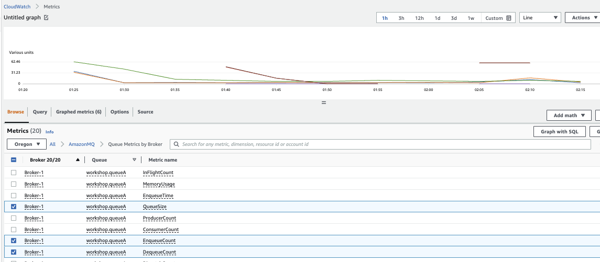
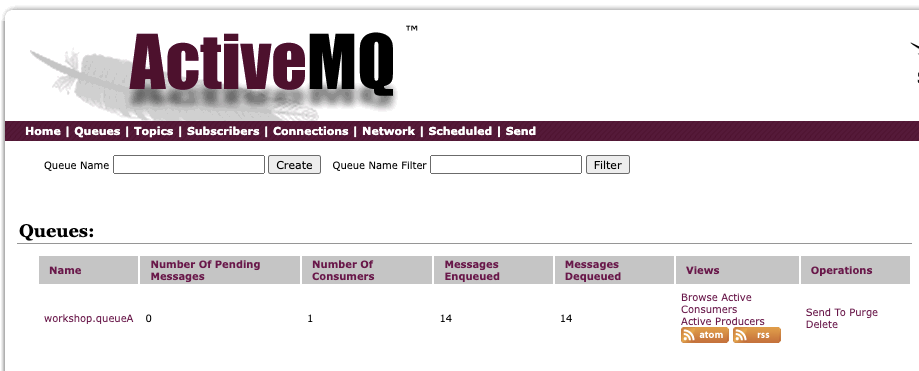
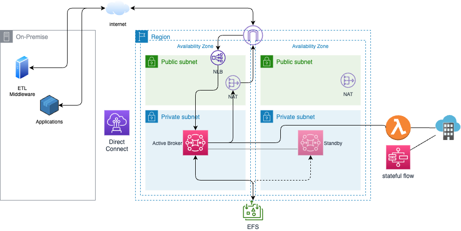
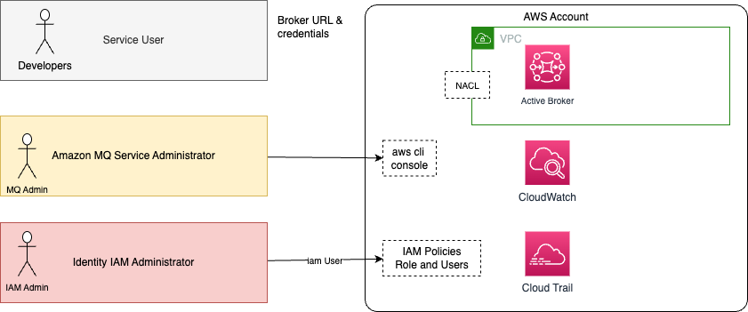
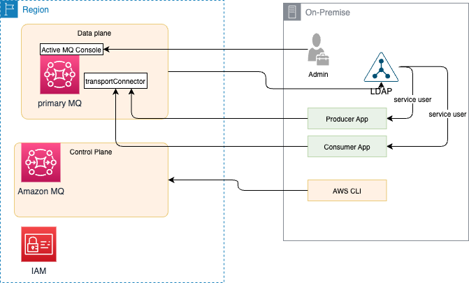

# [Amazon MQ](https://docs.aws.amazon.com/amazon-mq/latest/developer-guide/welcome.html)

Amazon MQ is a managed message broker for RabbitMQ or ActiveMQ. It runs on EC2 servers, and supports multi-AZs deployment with failover.

We can create brokers via Console ([see this lab](labs/aq-aws-console-lab.md)), using the AWS CLI, SDK or CDK.

As a queueing system, when a message is received and acknowledged by one receiver, it is no longer on the queue, and the next receiver to connect gets the next message on the queue.

Multiple senders can send messages to the same queue, and multiple receivers can receive messages from the same queue. But each message is only delivered to one receiver only.

With topics, a consumer gets messages from when it starts to consume, previous messages will not be seen. Multiple subscribers will get the same message. All the messages sent to the topic, from any sender, are delivered to all receivers.

The Amazon MQ Configuration is a specific object to manage the configuration of the broker. It can be created before the broker and supports Active MQ [activemq.xml configuration.](https://docs.aws.amazon.com/amazon-mq/latest/developer-guide/amazon-mq-broker-configuration-parameters.html)

## Value propositions

* Keep skill investment and code compatibility with existing on-premises applications.
* Reduce cost.
* Deployment automation with CloudFormation, deploy in minutes.
* Reduced operation overhead, including provisioning, updates, monitoring, maintenance, security and troubleshooting.
* Vertical scaling with EC2 instance size and type.
* Horizontal scaling through network of brokers.
* Queues and topics are in one service so we can easily fan out or build durable queue.
* Both Transient and persistent messages are supported to optimize for durability or performance.
* Lower latency.
* Support Lift and shift of existing apps to the cloud, or use an hybrid architecture.

## Performance considerations

* The size of the message determines performance of the broker, above 100k, storage throughput is a limiting factor.
* With in-memory queue without persistence, Active MQ can reach high throughput. With no message lost goal, it uses persistence with flush at each message, and it will be bound by the I/O capacity of the underlying persistence store, EBS or EFS. `mq.m5.large`.
* To improve throughput with Amazon MQ, make sure to have consumers processing messaging as fast as, or faster than the producers are pushing messages.
* With EFS replication, with cluster and HA, throughput will be lower.
* [Blog: "Measuring the throughput for Amazon MQ using the JMS Benchmark".](https://aws.amazon.com/blogs/compute/measuring-the-throughput-for-amazon-mq-using-the-jms-benchmark/)  


## [Pricing](https://aws.amazon.com/amazon-mq/pricing/)

We pay by the hour of broker time according to the type of EC2 used as broker. The topology also impacts pricing between single, active/standby and cluster.

Storage price is based on GB persisted on EFS in case of cluster, or EBS in case of single instance.

Data transfer pricing applies too:

* For Traffic forwarded between brokers across availability zones in the same region
* For Traffic cross-region based on EC2 pricing. In region is not charged.
* For traffic out to the internet.

## Monitoring

AmazonMQ publishes [utilization metrics for the brokers](https://docs.aws.amazon.com/amazon-mq/latest/developer-guide/security-logging-monitoring.html), such as `CpuUtilization, HeapUsage, NetworkOut`. If we have a configuration with a primary and a secondary broker, we will have independent metrics for each instance.

It also publishes metrics for queues and Topics such as `MemoryUsage, EnqueueCount` (messages published by producers), `DispatchCount` (message delivered to consumers).

{ width=900 }

**Figure 1: Queue monitoring with metrics**

Using Cloudwatch alarm we can auto scale the consumer based on metrics value.

From the AWS Amazon MQ Broker console, we can access to the Active MQ console and see the queues.

{ width=800 }

**Figure 2: Active MQ admin console**


## Maintenance

AWS is responsible of the hardware, OS, engine software update. Maintenance may be scheduled once a week and can take up to 2 hours. Automatic maintenance can be enforced for minor version upgrade.

## Topology

Amazon MQ - Active MQ supports the same topologies as the open-source version.

In the Amazon MQ, the primary AWS resources are the Amazon MQ message broker and its configuration. The broker can be deployed in SINGLE_INSTANCE, ACTIVE_STANDBY_MULTI_AZ, or CLUSTER_MULTI_AZ. The configuration can be done [via the AWS console](./labs/aq-aws-console-lab.md), AWS CLI, Cloud Formation or [CDK](./labs/activemq-cdk.md)

### Active Standby

Active / Standby topology uses a pair of brokers in different Availability Zones. One broker gets all the connection and traffic, the other is in standby, ready to take the traffic in case of failure of the active broker. The persistence is supported by a Storage Area Network.


**Figure 3: Amazon MQ - Active/standby shared storage**

Amazon [Elastic File System](https://docs.aws.amazon.com/efs/latest/ug/whatisefs.html) is the serverless file system used to persist messages. We can mount the EFS file systems on on-premises data center servers when connected to the Amazon VPC with AWS Direct Connect or AWS VPN.

For an active/standby broker, Amazon MQ provides two ActiveMQ Web Console URLs, but only one URL is active at a time. Adding failover in broker url like:

```sh
failover:(ssl://b-9f..7ac-1.mq.eu-west-2.amazonaws.com:61617,ssl://b-9f...c-2.mq.eu-west-2.amazonaws.com:61617)
```

 ensures that whenever server goes up, it will reconnect it immediately. [See Active MQ documentation on failover](https://activemq.apache.org/failover-transport-reference.html)

??? info "Network mapping"
    On AWS, each of those failover URL are in fact mapped to IP@ of a ENI. Each broker node has two [ENIs connected](https://docs.aws.amazon.com/amazon-mq/latest/developer-guide/connecting-to-amazon-mq.html) to two different networks. The `b-9f...-1` is mapped to 10.42.1.29 for example on subnet 1, while `b-9f...-2` is 10.42.0.92 to subnet 0.

#### Hybrid cloud with AWS

* During migration to the cloud, we need to support hybrid deployment where existing applications on-premises consume messages from queues or topics defined in Amazon MQ - Active MQ engine. The following diagram illustrates different possible integrations and the deployment of active/standby brokers in 2 availability zones.

    

    **Figure 4: Hybrid integration with Amazon MQ**

    * The on-premises applications or ETL jobs access the active broker, using public internet or private connection with Amazon Direct Connect, or site-to-site VPN.
    * For the public access, the internet gateway routes the traffic to a network load balancer (layer 4 TCP routing), which is also HA (not represented in the figure), to reach the active Broker.
    * The public internet traffic back from the Active MQ queue or topic to the consumer is via a NAT gateway. NAT gateways are defined in both public subnets for HA.
    * When using private gateways, the VPC route tables includes routes to the CIDR of the on-premises subnets.
    * Security group defines firewall like policies to authorize inbound and outbound traffic. The port for Active MQ needs to be open. Below is such declaration:
    * EFS is used as a shared file system for messages persistence.
    * The standby broker is linked to the active broker and ready to take the lead in case of active broker failure.
    * For higher bandwidth and secured connection, Direct Connect should be used and then the communication will be via private gateway end point.
    * Lambda function may be used to do light processing like data transformation, or data enrichment and then to call directly SaaS services. When more complex flow, like stateful flows, are needed, Amazon Step function can also be used (also serverless).

### Mesh

Amazon MQ proposes a mesh network of single-instance brokers with non shated files as each broker uses EBS volume.


**Figure 5: Amazon MQ broker mesh cluster deployment**


## Security considerations

Active MQ is coming with its own way to define access control to Queue, Topics and Brokers. 

* Access to AWS Console and Specific engine console to administrators.
* Encryption in transit via TLS.
* Encryption at rest using KMS: when creating the broker, we can select the KMS key to use to encrypt data.
* VPC support for brokers isolation and applications isolation.
* Security groups for firewall based rules.
* Queue/topic authentication and authorization using Configuration declarations.
* Integrated with CloudTrail for Amazon MQ API auditing.
* User accesses can be defined in an external LDAP, used for management Console access or for service accounts. Apps identifications are done inside the broker configuration.

Amazon MQ uses IAM for creating, updating, and deleting operations on the message broker or configuration, and native ActiveMQ authentication for connection to brokers. The following figure illustrates those security contexts:



We define three users:

1. An **IAM administrator** who manages security within an AWS account, specifically IAM users, roles and security policies. This administrator has full access to CloudWatch logs and CloudTrail for API usage auditing. The IAM policy uses action on "mq:" prefix, and possible resources are `broker` and `configuration`. 
1. An **MQ service administrator**, manages the MQ brokers and configuration via the AWS Console, AWS CLI or APIs. This administrator should be able to define brokers and configurations, networking access controls, security groups, and may be anything related to consumer and producer apps. He/she should have access to CloudWatch Logs and CloudTrail logs too. An administrator needs to signin to amazon api and get the [permissions to act on the broker](https://docs.aws.amazon.com/amazon-mq/latest/developer-guide/security-api-authentication-authorization.html#security-permissions-required-to-create-broker) and the underlying EC2 instances.
1. Developer defining queue, topics, and get broker URL and credentials. Developer users can be defined in external active directory or in broker configuration file.

Amazon MQ management operations like creating, updating and deleting brokers require IAM credentials and are not integrated with LDAP.

As the Amazon MQ control plane will do operations on other AWS services, there is a service-linked role (`AWSServiceRoleForAmazonMQ`) defined automatically when we define a broker, with the security policies ([AmazonMQServiceRolePolicy](https://console.aws.amazon.com/iam/home#policies/arn:aws:iam::aws:policy/aws-service-role/AmazonMQServiceRolePolicy)) to get the brokers deployed. A service-linked role is a unique type of IAM role that is linked directly to Amazon MQ.


Amazon MQ uses ActiveMQ's Simple Authentication Plugin to restrict reading and writing to destinations. See [this product documentation](https://docs.aws.amazon.com/amazon-mq/latest/developer-guide/security-authentication-authorization.html) for details.

### LDAP integration

* The LDAP integration is done via [ActiveMQ JAAS plugin](https://activemq.apache.org/security).

    

* A service account, defined in LDAP, is required to initiate a connection to an LDAP server. It sets up LDAP authentication for the brokers. Client connections are authenticated through this broker-LDAP connection.
* The on-premises LDAP server needs a DNS name, and be opened on port 636.
* When creating broker, we can specify the LDAP login configuration with User Base distinguished name, search filter, role base DN, role base search filter. The user base supplied to the ActiveMQ broker must point to the node in the Directory Information Tree where users are stored in the LDAP server.

As illustrated in figure above, we have to assess the different use cases:

1. A user accessing the MQ console, the authentication to the broker console will go to the LDAP server
1. Applications, producers or consumers, accessing the broker using the transport Connector URL, and authenticate via a service user defined in LDAP.
1. An administrator users access Amazon MQ control plane via API, using AWS CLI, to create brokers, configurations. This user needs to be part of the `amazonmq-console-admins` group.

For user authentication via LDAP we need to define the connection to LDAP in the broker configuration file, which also includes where to search the JMS topic and queue information in the DIT:

```xml
<plugins>
    <jaasAuthenticationPlugin configuration="LdapConfiguration" /> 
    <authorizationPlugin> 
     <map> 
       <cachedLDAPAuthorizationMap
            queueSearchBase="ou=Queue,ou=Destination,ou=ActiveMQ,dc=systems,dc=anycompany,dc=com"
            topicSearchBase="ou=Topic,ou=Destination,ou=ActiveMQ,dc=systems,dc=anycompany,dc=com"
            tempSearchBase="ou=Temp,ou=Destination,ou=ActiveMQ,dc=systems,dc=anycompany,dc=com"
            refreshInterval="300000"
            legacyGroupMapping="false"
        />
         ...
```

* Authorization is done on a per-destination basis (or wildcard, destination set) via the `cachedLdapAuthorizationMap` element, found in the broker’s `activemq.xml`. See [Amazon MQ product doc](https://docs.aws.amazon.com/amazon-mq/latest/developer-guide/security-authentication-authorization.html) for xml examples and [Active MQ doc with OpenLDAP example](https://activemq.apache.org/cached-ldap-authorization-module).
* In LDAP, we can define topics and queues in a Destination OU like: `dn: cn=carrides,ou=Queue,ou=Destination,ou=ActiveMQ,ou=systems,dc=anycompany,dc=com`, within those OU, either a wildcard or specific destination name can be provided (OU=ORDERS.$). Within each OU that represents a destination or a wildcard, we must create three security groups: admin, write, read, to include users or groups who have permission to perform the associated actions.

```ldif
dn: cn=admin,cn=carrides,ou=Queue,ou=Destination,ou=ActiveMQ,ou=systems,dc=anycompany,dc=com 
cn: admin 
description: Admin privilege group, members are roles 
member: cn=admin 
member: cn=webapp 
objectClass: groupOfNames 
objectClass: top 
```

Adding a user to the admin security group for a particular destination will enable the user to create and delete that queue or topic.


## FAQs

???- question "What needs to be done to migrate to Artemis"
    As of today Amazon MQ, Active MQ supports only Classic deployment and API. Moving to Artemis, means deploying on your own EC2 instances. Most of the JMS code will work or with minimum refactoring for the connection factory. The project dependencies need to be changed, the ActiveMQ connection factory class is different in term of package names, and if you use Jakarta JMS then package needs to be changed in the JMS producer and consumer classes.

???- question "What are the CLI commands that can be run on Amazon MQ?"
    See [this list](https://awscli.amazonaws.com/v2/documentation/api/latest/reference/mq/index.html). To run those we need a user or an IAM role with `mq:` actions allowed. 

???- question "Support of JMX for broker and destination management?"    
    Amazon MQ does not support JMX access, so queue needs to be created using code.

???- question "what are the critical metrics / log patterns that should be monitored in respect to MQ logs?"
    Amazon CloudWatch metrics has a specific Amazon MQ dashboard with CpuUtilization, CurrentConnectionCount, networking in/ou, producer and consumer counts. We can add our own metrics using the broker or queue specific ones. The following may be of interest for storage: (See [this re:post](https://repost.aws/knowledge-center/mq-persistent-store-is-full-errors)):
        
    * Store Percentage Usage
    * Journal Files for Full Recovery: # of journal files that are replayed after a clean shutdown.
    * Journal Files for Fast Recovery: same but for unclean shutdown. (too many pending messages in storage)

    When broker starts to have memory limit for a destination, then producer flow will be throttled, even blocked. (See [this note](https://activemq.apache.org/producer-flow-control.html))


## Good sources of information

* [Amazon MQ - Active MQ product doc](https://docs.aws.amazon.com/amazon-mq/latest/developer-guide/working-with-activemq.html)
* [AWS Active MQ Workshop](https://catalog.us-east-1.prod.workshops.aws/workshops/0b534eb9-fdfb-49f0-8df4-ebccca71a9eb/en-US)
* [git amazon-mq-workshop](https://github.com/aws-samples/amazon-mq-workshop.git)
* [Create broker AWS CLI command.](https://awscli.amazonaws.com/v2/documentation/api/latest/reference/mq/create-broker.html)
* [Amazon MQ CLI](https://github.com/antonwierenga/amazonmq-cli).
* [Using Amazon MQ as an event source for AWS Lambda](https://aws.amazon.com/blogs/compute/using-amazon-mq-as-an-event-source-for-aws-lambda/)
* [Implementing enterprise integration patterns with AWS messaging services: point-to-point channels.](https://aws.amazon.com/blogs/compute/implementing-enterprise-integration-patterns-with-aws-messaging-services-point-to-point-channels/)
* [CloudFormation template from the MQ Workshop](https://s3.amazonaws.com/amazon-mq-workshop/CreateAmazonMQWorkshop.yaml).
* [How do I troubleshoot Amazon MQ broker connection issues?](https://repost.aws/knowledge-center/mq-broker-connection-issues).