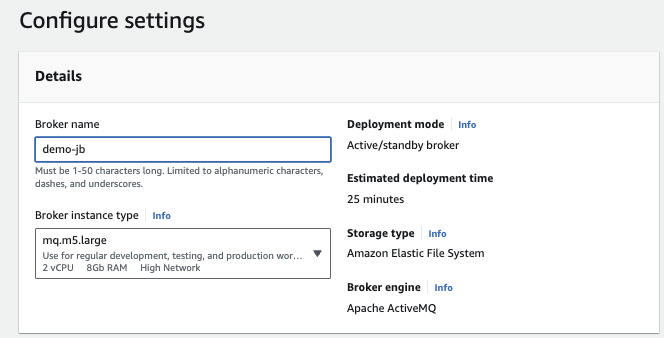

# Amazon MQ creating via the console

## Active MQ

The AWS console wizard is easy to get the brokers set up, and the most important elements of the configuration, is to select the type of deployment, the type of EC2 instance, product version, VPC, user credential, type of maintenance, logs.

For demonstration purpose, we can use a single-instance broker, on `mq.t3.micro` instance type.

For production we need to setup active/standby with shared persistence using Amazon EFS.

Here are some import screen shots for the configuration using AWS Console

Name and instance type:

Advanced setting, version, VPC, user to authenticate apps ...

To ensure that the broker is accessible within our VPC, we must enable the `enableDnsHostnames` and `enableDnsSupport` VPC attribute.

And add our host IP address to the security group on port 8162 (use https://whatismyipaddress.com/)

To allow Amazon MQ to publish logs to CloudWatch Logs, we must add a permission to our Amazon user and also configure a resource-based policy for Amazon MQ before creating or restarting the broker.