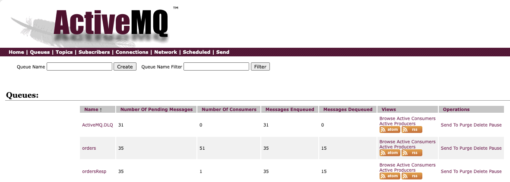

# JMS based request-replyTo demonstration - ActiveMQ Classic

This is a simple example of two applications communicating asynchronously over two queues:


This code uses client acknowledgement, and replyTo queue. It does not use CDI for bean injection but code base instantiation of the ConnectionFactory. It also supports reconnect in case of connection to broker failure.

The API used for JMS is 2.0 as ActiveMQ is the classic, version 5.13.

## Requirements

* Expose GET, POST, PUT `/orders` api
* Mockup a repository in memory
* On POST or PUT operations, order messages are sent to another service (the participant) to act on them via a `orders` queue, and get the response to `orders-reply` queue.
* Support once and only once semantic
* Expose a POST /orders/simulation to run n order creation with random data, to support a failover demonstration.

## Running Locally

While in development mode, under the `activeMQ/classic/request-replyto` folder:

1. Start Active MQ: `docker compose up -d`
1. Start each application with `quarkus dev`

    ```sh
    cd jms-orchestrator
    quarkus dev
    cd jms-participant
    quarkus dev
    ```

1. Orchestrator Application URL: [http://localhost:8081/](http://localhost:8081/) and swagger-ui
1. See ActiveMQ console: [http://localhost:8161/](http://localhost:8161/), admin/adminpassw0rd


## Demonstration scripts

1. Post new order using the exposed API by going under `request-replyto/e2e` folder:

    ```sh
    cd request-replyto/e2e
    ./postOrder.sh
    ```

1. In the Orchestrator trace we should see  the following message, from the Resource API, then getting the response from the participant of the order process as the status for order changed from `pending` to `assigned`

    ```sh
    processing new order: { "sku": P05,"price": 100.0,"quantity": 2,"status": pending }
    17:34:32 INFO  [or.ac.or.in.re.OrderRepositoryMem] (executor-thread-1) Save in repository 7cfef528
    17:34:32 INFO  [or.ac.or.in.ms.OrderMessageProcessing] (Thread-2 (ActiveMQ-client-global-threads)) Received message: b1c0191f-4533-44f9-b56d-18ec67baa1fc,7cfef528,P05,100.0,2,assigned
    ```

1. On the participant side the log looks like:

    ```sh
    Received message: b1c0191f-4533-44f9-b56d-18ec67baa1fc,7cfef528,P05,100.0,2,pending
    17:34:32 INFO  [or.ac.pa.in.ms.OrderMessageConsumer] (Thread-1 (ActiveMQ-client-global-threads)) Reponse sent to replyTo queue {"messageID":"b1c0191f-4533-44f9-b56d-18ec67baa1fc","orderID":"7cfef528","sku":"P05","price":100.0,"quantity":2,"status":"assigned"}
    ```

1. We can see the state of the queues in the ActiveMQ Console

    

1. To demonstrate connection failure and reconnect, start a long runnning simulation, stop the broker and relaunch it. The messages should continue to flow between the stop apps. Be sure to have build the producer and consumer images. Here are the commands:

    ```sh
    # build OCI image for participant and orchestrator app
    request-replyto $ ./buildAll.sh
    # We should have 2 new OCI images. 
    request-replyto $ docker images

    request-replyto $ docker compose -f e2e-docker-compose.yml up -d
    request-replyto $ docker ps
    # 3cd51215160f   apache/activemq-classic:latest  0.0.0.0:5672->5672/tcp, 8080/tcp, 0.0.0.0:8161->8161/tcp, 0.0.0.0:61616->61616/tcp, 8443/tcp   active
    # 2ce293bc26bd   apache/activemq-classic:latest  0.0.0.0:5682->5672/tcp, 0.0.0.0:8171->8161/tcp, 0.0.0.0:61626->61616/tcp standby
    ...
    ```

    Start some messages under `classic/request-replyto/e2e`

    ```sh
    e2e $ ./startNorders.sh 50
    ```

    Once some messages are exchanged stop the active broker.

## Code Explanation

The code is under [jms-orchestrator](./activeMQ/classic/request-replyto/jms-orchestrator/) and [jms-participant](./activeMQ/classic/request-replyto/jms-participant), to implement a request-response over queue using JMS.

The Orchestrator is a classical microservice with the order entity as resource. The interesting part is the `OrderMessageProcessing` class. It is JMS implementation code, using one connection to the broker and two JMS sessions, one for the producer and one for the consumer.

The API is jms 2.0 based on `javax.jms` API, and the ActiveMQ is the client app: here is the important maven declarations

```xml
    <!-- https://mvnrepository.com/artifact/javax.jms/javax.jms-api -->
    <dependency>
        <groupId>javax.jms</groupId>
        <artifactId>javax.jms-api</artifactId>
        <version>2.0.1</version>
    </dependency>

    <!-- https://mvnrepository.com/artifact/org.apache.activemq/activemq-client -->
    <dependency>
        <groupId>org.apache.activemq</groupId>
        <artifactId>activemq-client</artifactId>
        <version>5.18.2</version>
    </dependency>
```

The classical JMS implementation use the ConnectionFactory, create a unique connection to the broker, and then one session to send message and one to receive message from the different queue:

```java
connectionFactory = new ActiveMQConnectionFactory(connectionURLs);
connection = connectionFactory.createConnection(user, password);
connection.setClientID("p-" + System.currentTimeMillis());

initProducer();
initConsumer();
connection.start();    
```

As the class is MessageListener, the JMSconsumer thread is associate to it, and the `OrderMessageProcessing` class processes the replyTo queue messages in the onMessage method.

```java
 public void onMessage(Message msg) {
       TextMessage rawMsg = (TextMessage) msg;
       OrderMessage om;
        try {
            om = mapper.readValue(rawMsg.getText(),OrderMessage.class);
            logger.info("Received message: " + om.toString());
            Order o = OrderMessage.toOrder(om);
            service.processParticipantResponse(o);
            msg.acknowledge();
        }
        catch (JsonProcessingException | JMSException e) {
            e.printStackTrace();
        }
    }
```

We should follow some implementation best practices: 

* having a different data model for the message payload than the business entity persisted (Order and OrderMessage), 
* use a service class to implement the business logic to manage the business entity.
* a different Resource class to support the RESTful APIs

```
 orders
  ├── domain
  │   ├── Order.java
  │   └── OrderService.java
  └── infra
      ├── api
      │   ├── OrderResource.java
      │   └── SimulControl.java
      ├── msg
      │   ├── OrderMessage.java
      │   └── OrderMessageProcessor.java
      └── repo
          ├── OrderRepository.java
          └── OrderRepositoryMem.java
```

The configuration of the application is based on the quarkus way to declare config:

```sh
main.queue.name=orders
replyTo.queue.name=ordersResp
reconnect.delay.ins=5

# Configures the Artemis properties.
quarkus.artemis.url=tcp://localhost:61616
```

Which could be overwritten by environment variables as illustrated in the docker compose file:

```yaml
 environment:
      QUARKUS_ARTEMIS_URL: failover:(tcp://active:61616,tcp://standby:61617)?randomize=false
```

On the consumer side, the class is also a MessageListener, and a producer to the replyTo queue.

Each consumer performs acknowledgement by code. Acknowledging a consumed message automatically acknowledges the receipt of all messages that have been consumed by the current session.

## Some ActiveMQ configuration explanation

The config folder includes some activemq.xml for the active and standby broker and also the jetty.xml so the console is accessible from the host machine.

* Jetty configuration update include host to be 0.0.0.0

```xml
    <bean id="jettyPort" class="org.apache.activemq.web.WebConsolePort" init-method="start">
             <!-- the default port number for the web console -->
        <property name="host" value="0.0.0.0"/>
        <property name="port" value="8161"/>
    </bean>
```

* To be able to have active and standby to communicate and use shared storage, we need to add in active broker configuration the fact to use kahadb on a mounted end point and define a network connector to the partner:

```xml
    <persistenceAdapter>
        <kahaDB directory="/tmp/mq/kahadb"/>
    </persistenceAdapter>
    <networkConnectors>
        <networkConnector uri="static:(tcp://standby:61626)" />
    </networkConnectors>
```

## Deploy on AWS

1. First build the docker images for each service using `buildAll.sh` command: Change the name of the image to adapt to your ECR repository.

    ```sh
    cd jms-orchestrator
    buildAll.sh
    docker push toECR_repository
    cd jms-participant
    buildAll.sh
    docker push toECR_repository
    ```

1. If not already done, use CDK to deploy VPC, Brokers, and Cloud9.
1. Use CDK to deploy the two apps on ECS Fargate.

    ```sh
    cd infra
    cdk deploy
    ```