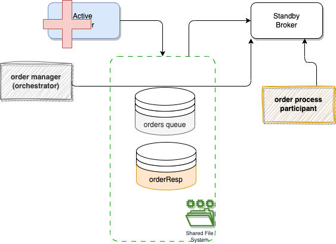
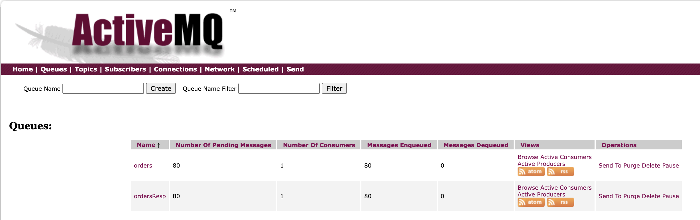

# Local failover demo

The demonstration is based on a shared store deployment as illustrated in the figure below:



The local deployment uses the active and standby brokers, and the orchestrator and participant applications communicating with request queue and response queue. 

The Failover stops the active broker and illustrates the reconnection to standby broker and continuing to produce and consume messages from thw two queues, without loosing messages.

## ActiveMQ Classic

The failover docker compose file is in [activeMQ/classic/failover](https://github.com/jbcodeforce/aws-messaging-study/tree/main/activeMQ/classic/failover) folder and uses the [jms-orchestrator](https://github.com/jbcodeforce/aws-messaging-study/tree/main/activeMQ/classic/request-replyto/jms-orchestrator) and [jms-participant](https://github.com/jbcodeforce/aws-messaging-study/tree/main/activeMQ/classic/request-replyto/jms-participant) applications.

### Demonstration

To demonstrate connection failure and automatic reconnect via ActiveMQ failover Transport protocol, we start a long runnning simulation, stop the active broker and let the standby taking the lead. The messages should continue to flow between the two apps. Be sure to have build the producer and consumer images before, if not here are the commands:

*  Build OCI images:

    ```sh
    # build OCI image for participant and orchestrator apps
    request-replyto $ ./buildAdd.sh
    request-replyto $ cd ../failover
    ```

!!! info "One script does all"
    The following steps are automated in one script, but you can do step by step too.

    ```sh
    ./testFailover.sh
    ```

1. Start the solution with docker compose

    ```sh
    failover$: docker compose -f e2e-docker-compose.yml up -d
    docker ps
    
    jbcodeforce/jms-classic-orchestrator  8443/tcp, 8778/tcp, 0.0.0.0:8081->8080/tcp orchestrator
    jbcodeforce/jms-classic-participant   8443/tcp, 0.0.0.0:8080->8080/tcp, 8778/tcp participant
    apache/activemq-classic:latest        0.0.0.0:5682->5672/tcp, 0.0.0.0:8171->8161/tcp, 0.0.0.0:61626->61616/tcp   standby
    apache/activemq-classic:latest        0.0.0.0:5672->5672/tcp, 0.0.0.0:8161->8161/tcp, 0.0.0.0:61616->61616/tcp   active
    
    ```

1. Verify connection of the two apps

    ```sh
    docker logs participant
    docker logs orchestrator
    ```

    We should see in the logs something like

    ```sh
    # Participant log
    [or.ap.ac.tr.fa.FailoverTransport] (ActiveMQ Task-1) Successfully connected to tcp://active:61616
    # orchestrator log
    [or.ap.ac.tr.fa.FailoverTransport] (ActiveMQ Task-1) Successfully connected to tcp://active:61616
    ```

1. Verify the queues at [http://localhost:8161/admin/queues.jsp](http://localhost:8161/admin/queues.jsp), we should have two queues and 1 consumer on each queue.

1. Start long simulation: it start 100 messages with a small pause of 1 second between message:
    
    ```sh
    ./e2e/startNorders 100
    ```

1. Stop the active broker

    ```sh
    docker stop active
    ```

1. Verify queues are visible in the standby admin console [http://localhost:8171/](http://localhost:8171/)

    

1. Verify in both applications logs the reconnection and consumption of messsages are working again: the broker crash around message `order_19`, the message was received, then the exception happens, followed by the reconnection, and getting new message from Standby broker (`order_20`).

    ```sh
    [or.ac.pa.in.ms.OrderMessageParticipantProcessor] (ActiveMQ Session Task-1) Received message: 5c8a9abe-82df-4dff-ab32-c9e18ed17e58,order_19,sku9,460.9405926370402,1,Pending
    [or.ac.pa.in.ms.OrderMessageParticipantProcessor] (ActiveMQ Session Task-1) Reponse sent to replyTo queue {"messageID":"5c8a9abe-82df-4dff-ab32-c9e18ed17e58","orderID":"order_19","sku":"sku9","price":460.9405926370402,"quantity":1,"status":"assigned"}
    [or.ap.ac.tr.fa.FailoverTransport] (ActiveMQ Transport: tcp://active/172.23.0.2:61616@36418) Transport (tcp://active:61616) failed, attempting to automatically reconnect: java.io.EOFException
        at java.base/java.io.DataInputStream.readInt(DataInputStream.java:397)
        at org.apache.activemq.openwire.OpenWireFormat.unmarshal(OpenWireFormat.java:280)
        at org.apache.activemq.transport.tcp.TcpTransport.readCommand(TcpTransport.java:240)
        at org.apache.activemq.transport.tcp.TcpTransport.doRun(TcpTransport.java:232)
        at org.apache.activemq.transport.tcp.TcpTransport.run(TcpTransport.java:215)
        at java.base/java.lang.Thread.run(Thread.java:829)

    [or.ac.pa.in.ms.OrderMessageParticipantProcessor] (ActiveMQ Transport: tcp://active/172.23.0.2:61616@36418) Transport interrupted ... it should recover...
    [or.ac.pa.in.ms.OrderMessageParticipantProcessor] (ActiveMQ Task-3) Transport resumed ... we were right to wait...
    [or.ap.ac.tr.fa.FailoverTransport] (ActiveMQ Task-3) Successfully reconnected to tcp://standby:61626
    [or.ac.pa.in.ms.OrderMessageParticipantProcessor] (ActiveMQ Session Task-1) Received message: 75cbf958-0f78-436d-b277-2807427b2c0e,order_20,sku7,838.9133296950124,2,Pending
    [or.ac.pa.in.ms.OrderMessageParticipantProcessor] (ActiveMQ Session Task-1) Reponse sent to replyTo queue {"messageID":"75cbf958-0f78-436d-b277-2807427b2c0e","orderID":"order_20","sku":"sku7","price":838.9133296950124,"quantity":2,"status":"assigned"}
    ```


1. Stop everything and delete the share folder

    ```sh
     docker compose -f e2e-docker-compose.yml down
     rm -r data 
    ```

!!! info "Clean up script"
    ```sh
    cleanTheTest.sh
    ```

### Configuration explanation

* In the docker compose each app has the failover URL, and hostnames are also defined to docker SDN will resolve to the assigned IP address of each broker:

    ```yaml
    environment:
      QUARKUS_ARTEMIS_URL: failover:(tcp://active:61616,tcp://standby:61626)?randomize=false
    ```

* Each broker configuration is mounted on the good path inside the broker container, as well as the shared filesystem (data to /tmp/mq/kahadb):

    ```yaml
    volumes:
      - ./config/broker-1.xml:/opt/apache-activemq/conf/activemq.xml
      - ./config/jetty.xml:/opt/apache-activemq/conf/jetty.xml
      - ./data:/tmp/mq/kahadb
    ```

* In the broker config which is mapped to activemq.xml we find the persistence declaration on the shared filesystem, the network connector between the brokers, and transport connections to accept external apps:

    ```xml
         <persistenceAdapter>
            <kahaDB directory="/tmp/mq/kahadb"/>
        </persistenceAdapter>
        <networkConnectors>
            <networkConnector uri="static:(tcp://standby:61626)" />
        </networkConnectors>
        <transportConnectors>
            <transportConnector name="openwire" uri="tcp://0.0.0.0:61616?maximumConnections=1000&amp;wireFormat.maxFrameSize=104857600;updateClusterClients=true"/>
    
    ```

    The 0.0.0.0 is important, to make the connection, as we run inside container with a docker define network.

## ActiveMQ Artemis

TO BE TERMINATED

The docker image to use is  [activeMQ/failover-pt-pt/mq-act-stby-docker-compose.yml](https://github.com/jbcodeforce/aws-messaging-samples/tree/main/activeMQ/failover-pt-pt/mq-act-stby-docker-compose.yml). 

The live broker configuration is in config/broker-1.xml and has the following declaration

```xml
<ha-policy>
    <shared-store>
        <master>
            <failover-on-shutdown>true</failover-on-shutdown>
        </master>
    </shared-store>
</ha-policy>
```

While the backup server has 

```xml
<ha-policy>
    <shared-store>
        <slave>
            <allow-failback>true</allow-failback>
        </slave>
    </shared-store>
</ha-policy>
```

To test the failover, start the active/passive brokers, and uses two different broker configurations in `config` folder.

```sh
docker compose -f mq-act-stby-docker-compose.yml up -d
# the container names include active and passive
```
