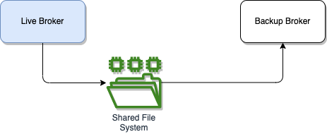

# Local failover demo

The demonstration is based on a shared store deployment as illustrated by the following figure



## ActiveMQ Classic

The failover docker compose is in [activeMQ/classic/failover](https://github.com/jbcodeforce/aws-messaging-study/tree/main/activeMQ/classic/failover) folder and use the [jms-orchestrator](https://github.com/jbcodeforce/aws-messaging-study/tree/main/activeMQ/classic/request-replyto/jms-orchestrator) and [jms-participant](https://github.com/jbcodeforce/aws-messaging-study/tree/main/activeMQ/classic/request-replyto/jms-participant) applications.

To demonstrate connection failure and automatic reconnect via ActiveMQ failover Transport protocol, we start a long runnning simulation, stop the broker and relaunch it. The messages should continue to flow between the stop apps. Be sure to have build the producer and consumer images. Here are the commands:

1. Build OCI images and start docker compose

    ```sh
    # build OCI image for participant and orchestrator apps
    request-replyto $ ./buildAdd.sh
    request-replyto $ cd ../failover
    failover$: docker compose -f e2e-docker-compose.yml up -d
    docker ps
    
    jbcodeforce/jms-classic-orchestrator  8443/tcp, 8778/tcp, 0.0.0.0:8081->8080/tcp orchestrator
    jbcodeforce/jms-classic-participant   8443/tcp, 0.0.0.0:8080->8080/tcp, 8778/tcp participant
    apache/activemq-classic:latest        0.0.0.0:5682->5672/tcp, 0.0.0.0:8171->8161/tcp, 0.0.0.0:61626->61616/tcp   standby
    apache/activemq-classic:latest        0.0.0.0:5672->5672/tcp, 0.0.0.0:8161->8161/tcp, 0.0.0.0:61616->61616/tcp   active
    
    ```

1. Verify connection of the two apps

    ```sh
    docker logs participant
    docker logs orchestrator
    ```

    We should see in the logs something like

    ```sh
    # Participant log
    [or.ap.ac.tr.fa.FailoverTransport] (ActiveMQ Task-1) Successfully connected to tcp://active:61616
    # orchestrator log
    [or.ap.ac.tr.fa.FailoverTransport] (ActiveMQ Task-1) Successfully connected to tcp://active:61616
    ```

1. Verify the queues at [http://localhost:8161/admin/queues.jsp](http://localhost:8161/admin/queues.jsp), we should have two queues and 1 consumer on each queue.

1. Start long simuation
    
    ```sh
    cd e2e
    ./startNorders 100
    ```

1. Stop the active broker

    ```sh
    cd ..
    docker stop active
    ```

1. Verify queues are visible in the standby admin console [http://localhost:8171/](http://localhost:8171/)

1. Verify in both applications logs the reconnection and consumption of messsages are working again.

1. Stop everything

    ```sh
     docker compose -f e2e-docker-compose.yml down 
    ```

## ActiveMQ Artemis

TO BE TERMINATED

The docker image to use is  [activeMQ/failover-pt-pt/mq-act-stby-docker-compose.yml](https://github.com/jbcodeforce/aws-messaging-samples/tree/main/activeMQ/failover-pt-pt/mq-act-stby-docker-compose.yml). 

The live broker configuration is in config/broker-1.xml and has the following declaration

```xml
<ha-policy>
    <shared-store>
        <master>
            <failover-on-shutdown>true</failover-on-shutdown>
        </master>
    </shared-store>
</ha-policy>
```

While the backup server has 

```xml
<ha-policy>
    <shared-store>
        <slave>
            <allow-failback>true</allow-failback>
        </slave>
    </shared-store>
</ha-policy>
```

To test the failover, start the active/passive brokers, and uses two different broker configurations in `config` folder.

```sh
docker compose -f mq-act-stby-docker-compose.yml up -d
# the container names include active and passive
```
