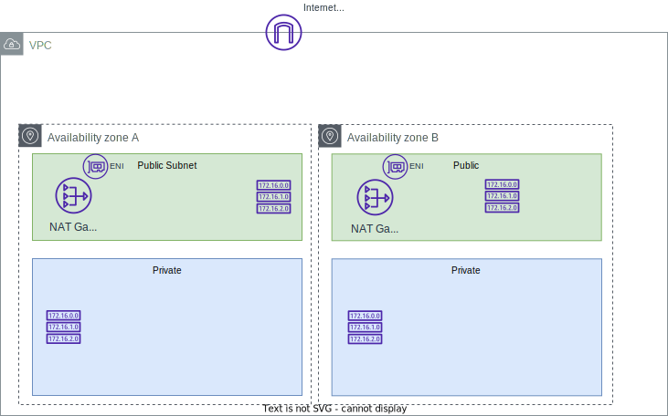
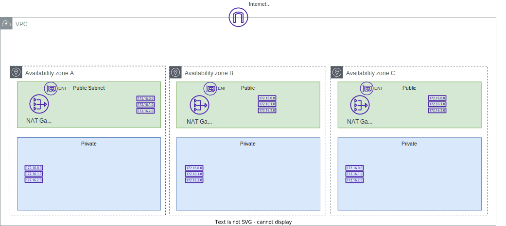
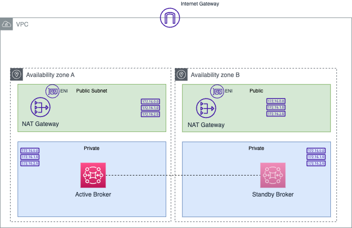

# Deploy ActiveMQ with AWS CDK

!!! Info
    Created 09/2023 - Updated 11/27/23

We assume you have CDK, AWS cli installed.

## Common Stack

The first stack is used to define a VPC with 2 AZs, 2 public subnets, 2 private subnets, 1 NAT gateway (for cost reason, in real production deployment we should have two), routes, and Network load balancer. The deployment looks like the following diagram:



To create the stack go to the `IaC-common` folder and use `cdk` CLI.

```sh
# under IaC-common folder
cdk synth
cdk deploy --all
```

Here are the resource created:

* One internet gateway, 2 NAT gateways, one in each in public subnet. Each NAT gateway has a Elastic Network Interface with public and private IP addresses.
* 2 route tables, one in each public subnet and one in each private subnet
* 2 route tables for the private subnet, that have egress route to NAT
* Security groups
* IAM role for the lambda function to assume, so it can update security groups in VPC
* Lambda function for removing all inbound/outbound rules from the VPC default security group
* Cloud 9 environment

For a production deployment, using Amazon MQ clustering, we will use a 3 AZs deployment as in figure below:



## Active MQ Active/Standby

To deploy an Amazon MQ - Active MQ with active and standby deployment use the stack under [amazonMQ/activeMQ/IaC/active-standby](https://github.com/jbcodeforce/aws-messaging-study/tree/main/amazonMQ/activeMQ/IaC/active-standby) which adds the following to current physical architecture:



The CDK gets the reference of the DemoVPC and will deploy the broker inside the private subnets.

Important, there are no official CDK hand-written (L2) constructs for Amazon MQ, so the APIs used are [amazonmq.CfnBroker](https://docs.aws.amazon.com/cdk/api/v2/python/aws_cdk.aws_amazonmq/CfnBroker.html) and [ConfigurationIdProperty](https://docs.aws.amazon.com/cdk/api/v2/python/aws_cdk.aws_amazonmq/CfnBroker.html#configurationidproperty).

Configuration can only referenced, so we need to create them manualy or using aws cli.

Before running `cdk deploy` verify the current version of Active MQ.