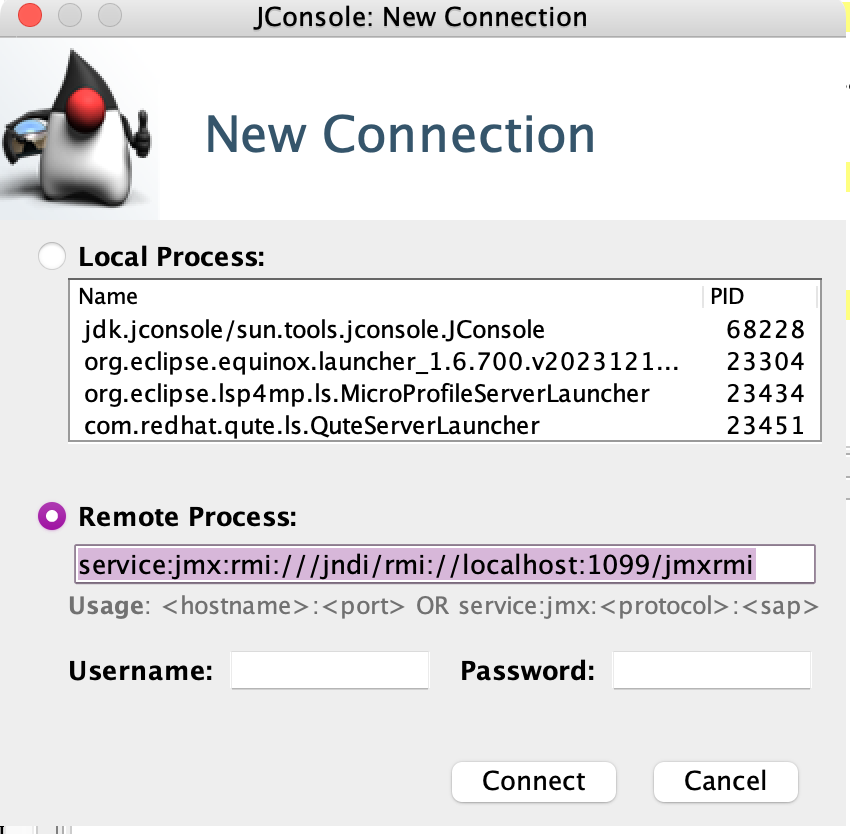
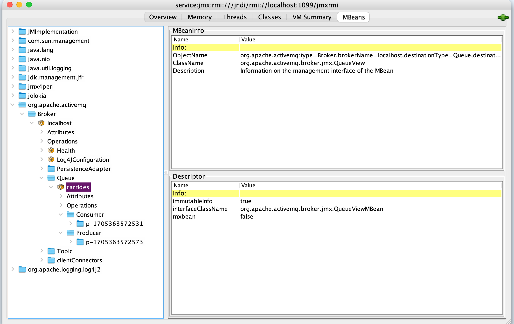
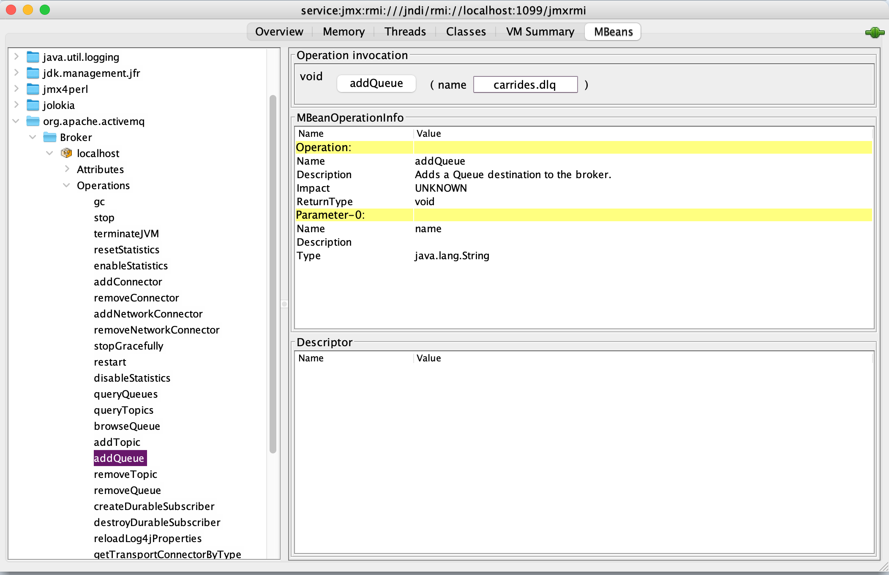
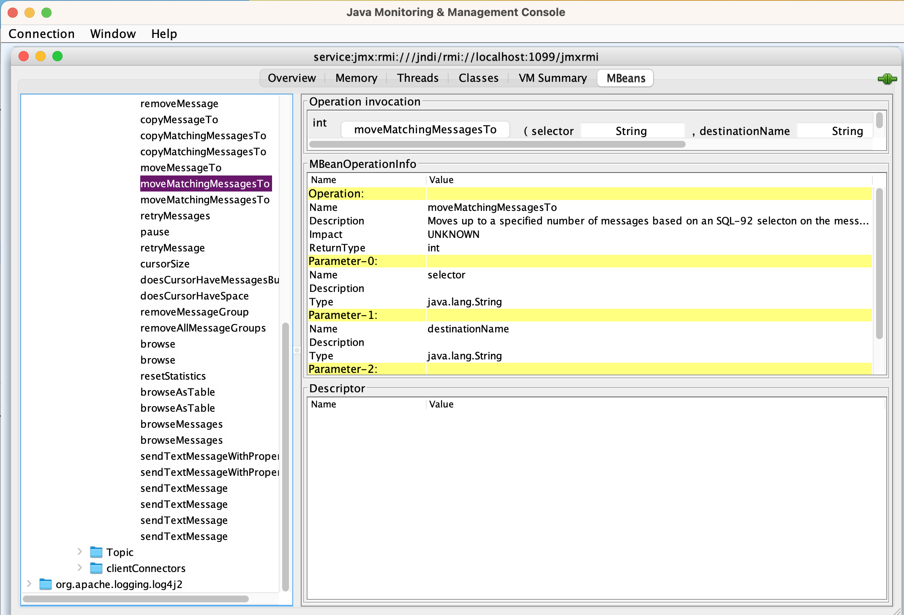
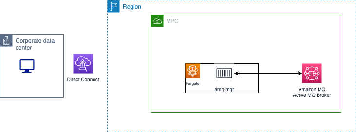

# ActiveMQ monitoring

## Local JMX test

Broker configuration define the connector and enable jmx:

```xml
 <broker xmlns="http://activemq.apache.org/schema/core" brokerName="localhost" dataDirectory="${activemq.data}" useJmx="true">
        ...
        <managementContext>
             <managementContext createConnector="true" connectorPort="1099" connectorHost="localhost"/>
        </managementContext>

```

The docker compose files under [](https://github.com/jbcodeforce/aws-messaging-study/blob/main/amazonMQ/activeMQ/ow-pt-to-pt-jms/) has the following java options to configure remote jmx access:

```yaml
    ACTIVEMQ_OPTS: "-Dcom.sun.management.jmxremote.port=38120 -Djava.rmi.server.hostname=$HOSTNAME -Dcom.sun.management.jmxremote.authenticate=false -Dcom.sun.management.jmxremote.ssl=false"
```

and the exported ports are: 1099 and 38120.

Once started the logs of the activeMQ java app lists the jmx URL for remote access: `activemq  |  INFO | JMX consoles can connect to service:jmx:rmi:///jndi/rmi://localhost:1099/jmxrmi`

Start `jconsole` from the Java JDK and then define the remote connection with the previous URL:

{width=400}

which after some time, to get the MBeans discovered should lead to the ActiveMQ MBeans screen. From there we can navigate to the queue created by one of the producer app:



Within the operations we can add new queue:



The new `carrides.dlq` is added.

From there it will be possible to move message from one queue (the DLQ one) to one of the processing queue using the move message operation at the queue level:



## Amazon MQ - ActiveMQ engine

JMX is not yet exposed on Amazon MQ - ActiveMQ broker engine: the useJmx attribute on the broker configuration is unsupported. For queue and topic metrics Amazon CloudWatch should give developers enough data points.

Jolokia is not an option as it uses the broker JMX Mbeans to support management operations exposed as REST/JSON API.

The ActiveMQ console is exposed to see queue and topic content.

In case it is not suffisant we can develop a simple WebApp that exposes some basic operation like creating a queue or topic and move message from a queue to another one, like the JMX move messages. The REST API could includes the following constructs:

| Path | Operation | Description | Example | Parameters |
| --- | --- | --- | --- | --- |
| /queues/ | POST | Create a new queue | { "name" : "carrides.dlq" } | a Json doc with properties for the queue |
| /queues/ | GET | Get the list of queues |  | a Json doc with queue descriptions |
| /queues/ | DELETE | Delete the specified queue | { "name" : "carrides.dlq" } | a Json doc with queue name |
| /queues/{queue_name}/moveMessageTo | PUT | Move a message from the queue as parameter to a destination, given the JMS message id | { "destinationName" : "carrides", "messageId": "..."  } | A Json doc with destination and messageId |
| /queues/{queue_name}/moveMatchingMessageTo | PUT | Move messages matching a filter from the queue as parameter to a destination | { "destinationName" : "carrides", "selector": " a sql filter" } | A Json doc with destination and filter selector |

This administration application can be deployed as a serverless on Amazon ECS Fargate, within the same VPC as the Amazon MQ brokers. The implementations of the mapper between REST api and Active MQ can use JMS, AMQ API and Amazon SDK.



See code sample in the [amq-mgr folder](https://github.com/jbcodeforce/aws-messaging-study/blob/main/amazonMQ/activeMQ/) with explanation on how to run it locally, and deploy it to AWS VPC.