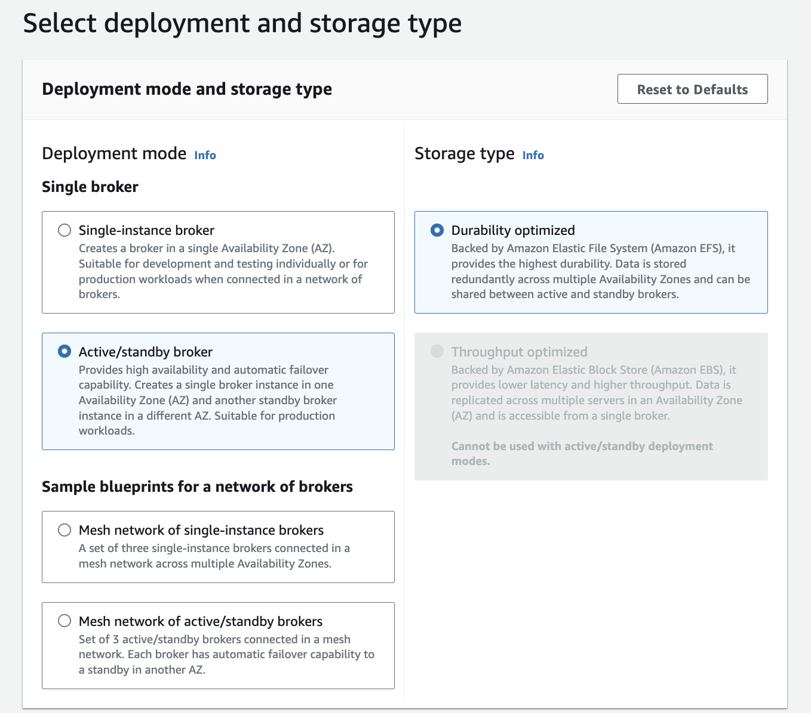
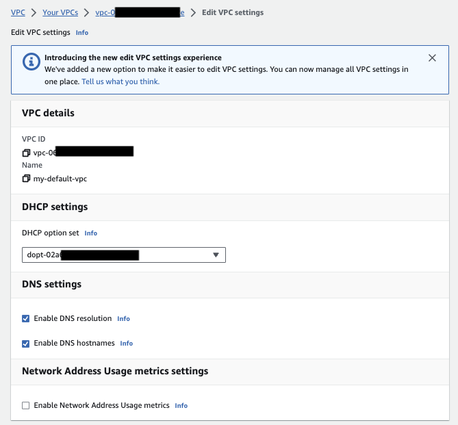

# Amazon MQ - Active MQ creation via the AWS console

This note is a simple summary of the steps to deploy Amazon MQ brokers using AWS console, for Active MQ and Rabbit MQ engines.

## Active MQ

The AWS console wizard is easy to get the brokers set up, and the most important elements of the configuration, is to select the engine, the type of deployment, the type of EC2 instance, the product version, VPC, user credential, type of maintenance, logging level.

For demonstration purpose, we can use a single-instance broker, on `mq.t3.micro` instance type. [EBS volumes](https://docs.aws.amazon.com/amazon-mq/latest/developer-guide/broker-storage.html) are for lower latency and higher throughput and cannot be used for clustered brokers in HA deployment. It will scale to 500 msg/s per broker. EBS can be replicated within the same AZ. For HA, EFS is used.

For production, we need to setup active/standby with shared persistence using Amazon EFS, or for more complex topology, use a broker Mesh.

Here are some important configurations using AWS Console: 

1. Select the deployment mode (see [topology section](../activemq.md/#topologies)) for diagrams. The blueprint offers the different broker mesh topologies.

    { width=700 }

1. Select a cluster name and the EC2 instance type:

    { width=700 }

1. In `Advanced` settings, select product version, VPC, user to authenticate apps and console... Broker configurations are separated elements, so can be reused between cluster.

    { width=700 }

    To ensure that the broker is accessible within our VPC, we must enable the `enableDnsHostnames` and `enableDnsSupport` VPC attributes.

    { width=700 }

    When developing solution, and deploying with public access, add our host IP address to the security group on port 8162 (use [https://whatismyipaddress.com/](https://whatismyipaddress.com))

1. To allow Amazon MQ to publish logs to CloudWatch Logs, we must add a permission to our Amazon user and also configure a resource-based policy for Amazon MQ before creating or restarting the broker.

1. Once created the `Connection section` includes the different URLs. 

    

    To access the console we need to update the inbound rules of the VPC default security group to add port 8162, and 61617.

1. Access to the Active MQ Console with the admin user.
1. Finally to test a producer and consumer apps, we can use a docker compose file that will start both apps but connect to the remote broker:

    ```sh
    cd amazonMQ/activeMQ/ow-pt-to-pt-jms
    export AMQ_URL=ssl://b-c05ed3bc-58e7-4309-bb9c-9c3a581228ee-1.mq.us-west-2.amazonaws.com:61617
    docker compose -f aws-amq-docker-compose.yml up
    ```

    We should get a Connec to broker suceed messages in the producer and the consumer apps. The queue should have been created by the code.

    

    Sending some data with `./e2e/startSimulation.sh`. The execution trace demonstrates messages published and consumed.

???- info "Broker Configuration"
    By default a configuration is created. An example of such configuration is under [the amazonMQ/activeMQ/ow-pt-to-pt-jms/config folder](https://github.com/jbcodeforce/aws-messaging-study/tree/main/amazonMQ/activeMQ/ow-pt-to-pt-jms/config/broker-config.xml).