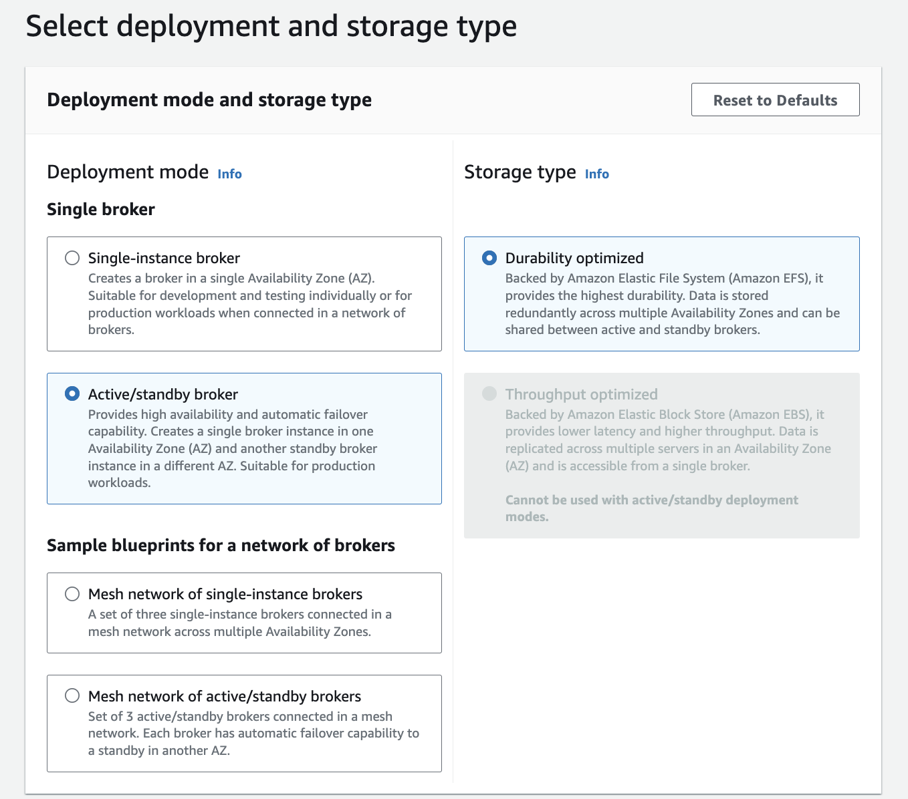
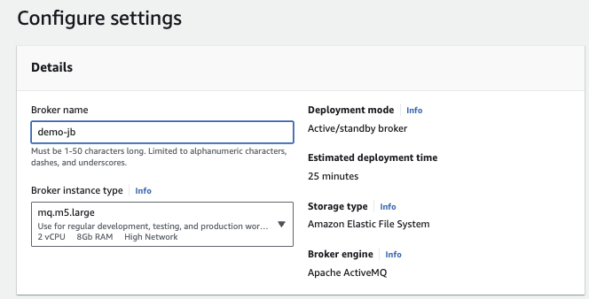

# Amazon MQ creating via the console

Review the manual process with some parameter explanations.

## Active MQ

The AWS console wizard is easy to get the brokers set up, and the most important elements of the configuration, is to select the type of deployment, the type of EC2 instance, product version, VPC, user credential, type of maintenance, logging level.

For demonstration purpose, we can use a single-instance broker, on `mq.t3.micro` instance type. [EBS volumes](https://docs.aws.amazon.com/amazon-mq/latest/developer-guide/broker-storage.html) are for lower latency and higher throughput and cannot be used for clustered brokers in HA deployment. It will scale to 500 msg/s per broker. EBS can be replicated within the same AZ. For HA, EFS is used.

For production we need to setup active/standby with shared persistence using Amazon EFS.

Here are some important configuration using AWS Console: 1/ Select the deployment mode (see [topology section](../activemq.md/#topologies)) for diagrams. The blueprint offers the borker mesh topologies.

{ width=700 }

Select a cluster name and the EC2 instance type:

{ width=700 }

Advanced settings for product version, VPC, user to authenticate apps and console... Broker configurations are separated elements, so can be reused between cluster. 

{ width=700 }

To ensure that the broker is accessible within our VPC, we must enable the `enableDnsHostnames` and `enableDnsSupport` VPC attributes.

{ width=700 }

When developing solution, and deploying with public access, add our host IP address to the security group on port 8162 (use https://whatismyipaddress.com/)

To allow Amazon MQ to publish logs to CloudWatch Logs, we must add a permission to our Amazon user and also configure a resource-based policy for Amazon MQ before creating or restarting the broker.

## Rabbit MQ

TBD