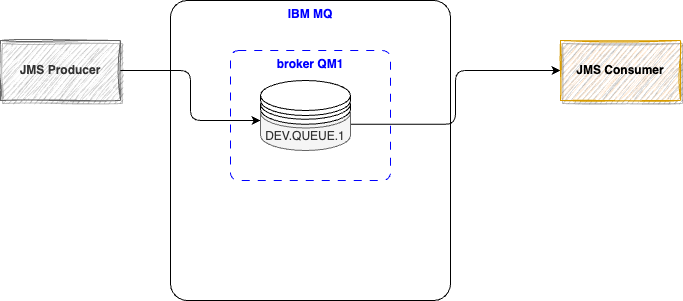
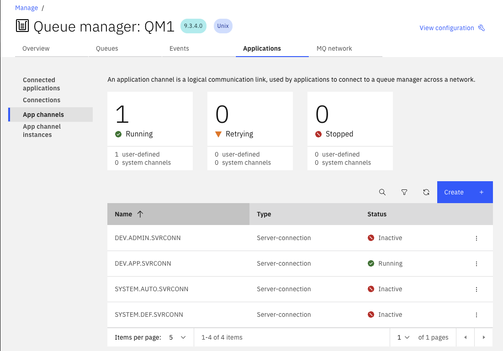
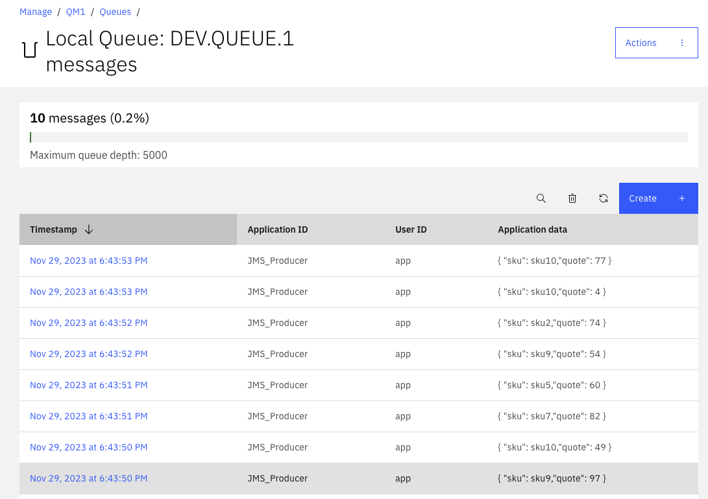

# IBM MQ Labs

This note regroups explanations of the different code samples to run on top of IBM MQ.

## Create a IBM MQ docker image for Mac silicon

With MAC M silicon, we need a different docker image, the information to build such image is in [this repository](https://github.com/ibm-messaging/mq-container.git), but it is simple, once the repository cloned do: `make build-devserver`. The created docker image on 11/22/2023 is `ibm-mqadvanced-server-dev:9.3.4.0-arm64`.

The docker compose file in [docker-compose for ibm mq](https://github.com/jbcodeforce/aws-messaging-study/blob/main/ibm-mq/src/dev-dc.yaml) can start one instance of IBM MQ broker to be used for development purpose.

## One-way point-to-point code based on JMS

For the first demonstration we take a simple JMS producer to send message to IBM MQ queue, `DEV.QUEUE.1`, consumed by a JMS Consumer App. It is a one-way integration pattern with a point-to-point channel using queue. Nothing fancy, but interesting to see the change to the configuration to work with MQ. Here is the simple diagram:



### Developing the JMS producer

* Under [pt-to-pt-jms](https://github.com/jbcodeforce/aws-messaging-study/tree/main/ibm-mq/src/pt-to-pt-jms) folder, start one IBM MQ Broker with docker: `docker-compose -f dev-dc.yaml up -d`
* Under `jms-producer` folder, use `quarkus dev` to test the app.

Some important notes:

* The IBM MQ docker in dev mode (set by environment variable:  `MQ_DEV: true` in docker compose file), has the following predefined MQ objects: `DEV.QUEUE.1`, `DEV.QUEUE.2`, `DEV.QUEUE.3`, `DEV.DEAD.LETTER.QUEUE` and the `DEV.APP.SVRCONN` and `DEV.ADMIN.SVRCONN` channel. We can use this channel and one of the queue for the demonstration.
* In the docker compose file, the fact that we configure the env variable `MQ_APP_PASSWORD` with a password means we need to do the same for the application.
* The `application.properties` file for the quarkus app defines user and password to be used to connect, as well as the channel and the queue name:

  ```sh
  mq.host=localhost
  mq.port=1414
  mq.channel=DEV.APP.SVRCONN
  mq.qmgr=QM1
  mq.app_user=app
  mq.app_password=passw0rd
  mq.queue_name=DEV.QUEUE.1
  ```

* The connection code has some small modifications as summarized below:

  ```java
  JmsFactoryFactory ff = JmsFactoryFactory.getInstance(WMQConstants.WMQ_PROVIDER);
  connectionFactory = ff.createConnectionFactory();
  connectionFactory.setStringProperty(WMQConstants.WMQ_HOST_NAME, this.mqHostname);
  connectionFactory.setIntProperty(WMQConstants.WMQ_PORT, this.mqHostport);
  connectionFactory.setStringProperty(WMQConstants.WMQ_CHANNEL, this.mqChannel);
  connectionFactory.setIntProperty(WMQConstants.WMQ_CONNECTION_MODE, WMQConstants.WMQ_CM_CLIENT);
  connectionFactory.setStringProperty(WMQConstants.WMQ_QUEUE_MANAGER, this.mqQmgr);
  connectionFactory.setStringProperty(WMQConstants.WMQ_APPLICATIONNAME, this.appName);
  connectionFactory.setBooleanProperty(WMQConstants.USER_AUTHENTICATION_MQCSP, false);
  connectionFactory.setStringProperty(WMQConstants.USERID, this.mqAppUser);
  connectionFactory.setStringProperty(WMQConstants.PASSWORD, this.mqPassword);
  ```

  be sure to add IBM MQ dependency in the pom.xml

  ```xml
    <dependency>
      <groupId>com.ibm.mq</groupId>
      <artifactId>com.ibm.mq.allclient</artifactId>
      <version>9.3.4.0</version>
    </dependency>
  ```

  We will see CCDT parameters later.

* Once the app runs, it should be connected with logs showing:

  ```java
  18:41:36 INFO  [or.ac.jm.ProductQuoteProducer] (Quarkus Main Thread) Hostname: localhost
  18:41:36 INFO  [or.ac.jm.ProductQuoteProducer] (Quarkus Main Thread) Port: 1414
  18:41:36 INFO  [or.ac.jm.ProductQuoteProducer] (Quarkus Main Thread) Channel: DEV.APP.SVRCONN
  18:41:36 INFO  [or.ac.jm.ProductQuoteProducer] (Quarkus Main Thread) Qmgr: QM1
  18:41:36 INFO  [or.ac.jm.ProductQuoteProducer] (Quarkus Main Thread) App User: app
  18:41:36 INFO  [or.ac.jm.ProductQuoteProducer] (Quarkus Main Thread) No valid CCDT file detected. Using host, port, and channel properties instead.
  18:41:36 INFO  [or.ac.jm.ProductQuoteProducer] (Quarkus Main Thread) Connect to broker succeed
  18:41:36 INFO  [or.ac.jm.ProductQuoteProducer] (Quarkus Main Thread) JMS Producer Started
  ```

* In the IBM MQ we can see the running channel and the connected application

  

* Posting to the simul REST end point will generate 10 messages:

  ```sh
  curl -X 'POST' \
  'http://localhost:8081/simulator' \
  -H 'accept: application/json' \
  -H 'Content-Type: application/json' \
  -d '{
  "delay": 0,
  "totalMessageToSend": 10
  }'
  ```

* The messages are in the queue

  


### Developing the JMS consumer

This time the code is in [pt-to-pt-jms/jms-consumer](https://github.com/jbcodeforce/aws-messaging-study/tree/main/ibm-mq/src/pt-to-pt-jms/jms-consumer). The classical JMS MessageListener implementation with the same code to initiate connection to the server. The code is using Jackson mapper for Json to Java Object for the Quote.

The code supports reconnection on exception with some delay to try to reconnect.

### Local IBM MQ docker end-to-end demo

1. Be sure to build the producer and consumer docker images with `./buildAll.sh` under `pt-to-pt-jms` folder.
1. Under `pt-to-pt-jms` start docker compose with one IBM MQ broker: `docker-compose up`. The trace should demonstrate that IBM MQ will take a little bit more time than the two quarkus apps to start, but those apps are able to reconnect, as they retries every 5 seconds to reconnect to the brokers.
1. Connect to the Console at [https://localhost:9443](https://localhost:9443), accept the risk on the non-CA certificate, and use admin/passw0rd to access the console.
1. Connect to the Consumer web page to see the last quote: [http://localhost:8080](http://localhost:8080)
1. Connect to the Producer swagger UI: [http://localhost:8081/q/swagger-ui](http://localhost:8081/q/swagger-ui) and start a simulation with 20 records. The trace should list the message produces and consumes.

```java
consumer  | 05:21:43 INFO  [or.ac.jm.in.ms.ProductQuoteConsumer] (DispatchThread: [com.ibm.mq.jmqi.remote.impl.RemoteSession[:/43f01614][connectionId=414D5143514D312020202020202020209A1B686500310040,traceIdentifier=5,remoteTraceIdentifier=8]]) Received message: { "sku": sku8,"quote": 83 }
producer  | 05:21:43 INFO  [or.ac.jm.in.ms.ProductQuoteProducer] (executor-thread-1) Sent: {"sku":"sku8","quote":83}
producer  | 05:21:44 INFO  [or.ac.jm.in.ms.ProductQuoteProducer] (executor-thread-1) Sent: {"sku":"sku1","quote":69}
consumer  | 05:21:44 INFO  [or.ac.jm.in.ms.ProductQuoteConsumer] (DispatchThread: [com.ibm.mq.jmqi.remote.impl.RemoteSession[:/43f01614][connectionId=414D5143514D312020202020202020209A1B686500310040,traceIdentifier=5,remoteTraceIdentifier=8]]) Received message: { "sku": sku1,"quote": 69 }
producer  | 05:21:44 INFO  [or.ac.jm.in.ms.ProductQuoteProducer] (executor-thread-1) Sent: {"sku":"sku7","quote":18}
consumer  | 05:21:44 INFO  [or.ac.jm.in.ms.ProductQuoteConsumer] (DispatchThread: [com.ibm.mq.jmqi.remote.impl.RemoteSession[:/43f01614][connectionId=414D5143514D312020202020202020209A1B686500310040,traceIdentifier=5,remoteTraceIdentifier=8]]) Received message: { "sku": sku7,"quote": 18 }
producer  | 05:21:45 INFO  [or.ac.jm.in.ms.ProductQuoteProducer] (executor-thread-1) Sent: {"sku":"sku10","quote":94}
consumer  | 05:21:45 INFO  [or.ac.jm.in.ms.ProductQuoteConsumer] (DispatchThread: [com.ibm.mq.jmqi.remote.impl.RemoteSession[:/43f01614][connectionId=414D5143514D312020202020202020209A1B686500310040,traceIdentifier=5,remoteTraceIdentifier=8]]) Received message: { "sku": sku10,"quote": 94 }
producer  | 05:21:45 INFO  [or.ac.jm.in.ms.ProductQuoteProducer] (executor-thread-1) Sent: {"sku":"sku6","quote":59}
consumer  | 05:21:45 INFO  [or.ac.jm.in.ms.ProductQuoteConsumer] (DispatchThread: [com.ibm.mq.jmqi.remote.impl.RemoteSession[:/43f01614][connectionId=414D5143514D312020202020202020209A1B686500310040,traceIdentifier=5,remoteTraceIdentifier=8]]) Received message: { "sku": sku6,"quote": 59 }
```

## AWS deployment

We can do a manual deployment or using CDK.

### Installing docker on one EC2 instance

Once creating a t3.micro EC2 instance, SSH to it and then do the following steps:

* Install docker, docker compose, start the service, add ec2-user to docker group.

```sh
sudo yum install -y docker
sudo service docker start
sudo usermod -a -G docker ec2-user
sudo chkconfig docker on
sudo curl -L https://github.com/docker/compose/releases/latest/download/docker-compose-$(uname -s)-$(uname -m) -o /usr/local/bin/docker-compose
 sudo chmod +x /usr/local/bin/docker-compose
# logout - login back
docker info
docker-compose version
# logout and login again with ec2-user - to avoid the permission denied on docker socket.
docker images 
```

### Installing IBM MQ docker image on EC2

* The docker image to use on Linux AMI 2023 is: `icr.io/ibm-messaging/mq:latest`. 

```sh
docker pull icr.io/ibm-messaging/mq:latest
```

* Create a docker compose file to use this image:

```yaml
version: '3.7'
services:
  ibmmq:
    image: icr.io/ibm-messaging/mq:latest
    docker_name: ibmmq
    ports:
        - '1414:1414'
        - '9443:9443'
        - '9157:9157'
    volumes:
        - qm1data:/mnt/mqm
    stdin_open: true
    tty: true
    restart: always
    environment:
        LICENSE: accept
        MQ_QMGR_NAME: QM1
        MQ_ADMIN_PASSWORD: passw0rd
        MQ_APP_PASSWORD: passw0rd
        MQ_ENABLE_METRICS: true
        MQ_DEV: true
volumes:
  qm1data:
```

* Modify the security group of the EC2 instance to add an inbound rule for custom TCP on port 9443, and another one for TCP port 1414.

* Start the MQ server

```sh
docker-compose up -d
```

* Access the IBM Console via the EC2 public URL with port 9443, accept the risk, the user is admin user and password.

### Deployment the apps in ECS Fargate

We can upload the two created docker images to ECR, then defines tasks and service.

1. First build the docker images for each service using `buildAll.sh` command: Change the name of the image to adapt to your ECR repository.

    ```sh
    cd jms-orchestrator
    buildAll.sh
    docker push toECR_repository
    cd jms-participant
    buildAll.sh
    docker push toECR_repository
    ```

1. If not already done, use CDK to deploy VPC, Brokers using [the instructions here](./activemq-cdk.md/#common-stack).
1. Deploy Active MQ in [active/standby architecture](./activemq-cdk.md/#active-mq-activestandby)
1. Use CDK to deploy the two apps on ECS Fargate.

## Solution CDK deployment

The CDK approach deploy an EC2 for IBM MQ broker, the two apps in ECS Fargate.


### Logging

https://docs.aws.amazon.com/amazon-mq/latest/developer-guide/security-logging-monitoring-cloudwatch.html
https://docs.aws.amazon.com/amazon-mq/latest/developer-guide/amazon-mq-accessing-metrics.html


## Useful source of information

* [IBM MQ Developer Essentials](https://developer.ibm.com/learningpaths/ibm-mq-badge)
* [MQ Developer Cheat sheet:](https://developer.ibm.com/articles/mq-dev-cheat-sheet/) useful for MQRC_NOT_AUTHORIZED error.
* [Configuring connections between the client and server](https://www.ibm.com/docs/en/ibm-mq/9.3?topic=configuring-connections-between-client-server): 