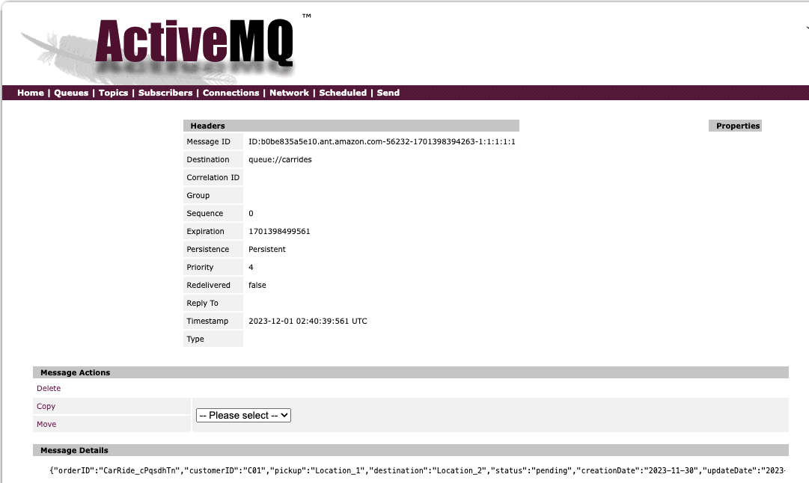

# On-way pattern with Point to Point JMS based producer and consumer

This demonstration is for a one-way integration between a producer app and a consumer app using one queue defined in ActiveMQ. The code is under the [activeMQ/ow-pt-to-pt-jms](https://github.com/jbcodeforce/aws-messaging-study/tree/main/amazonMQ/activeMQ/ow-pt-to-pt-jms) folder.

## Requirements

* Produce message to a queue using JMS protocol, using Java Quarkus.
* Consumer in a separate app, using JMS


## Running Locally

* Build the two docker images for jms-producer and jms-consumer components

```sh
# under jms-producer
./buildAll.sh
# jms-consumer
./buildAll.sh 
```

Or use under the `ow-pt-to-pt-jms` folder the `./buildAll.sh` command.

* Start the one ActiveMQ artemis broker with the the producer and consumer apps:

```sh
docker compose up -d
```

* The Active MQ console: [http://localhost:8161/console](http://localhost:8161/).
* Use the Producer REST API to send one CarRide at [Producer home](http://localhost:8081/) and then the Swagger UI link, using the following json:

    ```json
    {
    "customerID": "C01",
    "pickup": "Location_1",
    "destination": "Location_2",
    "rideDate": "11/30/2023",
    "rideTime": "10:00",
    "numberOfPassengers": 2
    }
    ```

    


    Another way is to use curl

    ```sh
    curl -X 'POST' \
    'http://localhost:8081/carrides' \
    -H 'accept: */*' \
    -H 'Content-Type: application/json' \
    -d '{
    "customerID": "C01",
    "pickup": "Location_1",
    "destination": "Location_2",
    "rideDate": "11/30/2023",
    "rideTime": "10:00",
    "numberOfPassengers": 2
    }'
    ```

* Once the consumer is running the message appears in the logs: `docker logs consumer`. Or a call to the REST URL will get the last one received:

    ```
    curl -X 'GET' \
    'http://localhost:8080/carrides/last' \
    -H 'accept: text/plain'
    ```

    See also the swagger: http://localhost:8080/q/swagger-ui/

* Finally use the Simulator controller to send n random CarRides

    ```sh
    curl -X 'POST' \
    'http://localhost:8081/carrides/simulator' \
    -H 'accept: application/json' \
    -H 'Content-Type: application/json' \
    -d '{
    "delay": 0,
    "totalMessageToSend": 10
    }'
    ```

* Stop the demo: `docker compose down`

## Code Explanation

The microservice uses the onion architecture from domain-driven design practices with an example of package structure as:

```sh
└── org
    └── acme
        └── jms
            ├── infra
            │   ├── api
            │   │   ├── CarRideDTO.java
            │   │   ├── CarRideResource.java
            │   │   └── SimulControl.java
            │   └── msg
            │       └── CarRideMsgProducer.java
            └── model
                └── CarRide.java
```

The APIs are classical REST resources. The business object is a CarRide to represent booking an autonoumous car ride. The messaging includes specific code for producer, consumer or both in the case pf request/response implementation.

As an example, the CarRideProducer is unique in the virtual machine via the ApplicationScoped annotation, and implements ExceptionListener to be able to implement some resilience mechanism in case of broker failover.

```java
@ApplicationScoped
public class CarRidesProducer implements ExceptionListener{
```

As a Quarkus app, properties are defined in `src/main/resources/application.properties` and injected in the class.

```java
    @Inject
    @ConfigProperty(name="queue.name")
    public String outQueueName;
    @Inject
    @ConfigProperty(name="activemq.url")
    public String connectionURLs;
```

Then the implementation approach is to start to connect to the Broker via JMS as soon as the application is started. (Listen to start event)

```java
void onStart(@Observes StartupEvent ev) {
        try {
            restablishConnection();
```

The connection setup uses classical JMS programming model, with the ConnectionFactory coming from ActiveMQ.

```java
private synchronized void restablishConnection() throws JMSException {
        if (connection == null) {
            displayParameters();
            connectionFactory = new ActiveMQConnectionFactory(connectionURLs);
            connection = connectionFactory.createConnection(user, password);
            connection.setClientID("p-" + System.currentTimeMillis());
            connection.setExceptionListener(this);
        } 
        if (producer == null || producerSession == null) {
            producerSession = connection.createSession();
            outQueue = producerSession.createQueue(outQueueName);
            producer = producerSession.createProducer(outQueue);
            producer.setTimeToLive(60000); // one minute
        }
        connection.start();
        logger.info("Connect to broker succeed");
    }
```

So the pom.xml needs to includes the Active MQ jars, as well as the jms api jar:

```xml
    <dependency>
        <groupId>org.apache.activemq</groupId>
        <artifactId>activemq-client</artifactId>
        <version>5.18.3</version>
    </dependency>
```

## Deploy on AWS

* Create ECR repositories for the two apps:

    ```sh
    aws ecr create-repository --repository-name j9r/amq-jms-consumer
    aws ecr create-repository --repository-name j9r/amq-jms-producer
    ```

* Push the two docker images to ECR:

    ```sh
    export AWS_ACCOUNT_ID=
    export REGION=us-west-2
    aws ecr get-login-password --region $REGION | docker login --username AWS --password-stdin $AWS_ACCOUNT_ID.dkr.ecr.$REGION.amazonaws.com
    docker tag j9r/amq-jms-consumer:latest $AWS_ACCOUNT_ID.dkr.ecr.$REGION.amazonaws.com/j9r/amq-jms-consumer:latest
    docker push $AWS_ACCOUNT_ID.dkr.ecr.$REGION.amazonaws.com/j9r/amq-jms-consumer:latest
    #
    docker tag j9r/amq-jms-producer:latest $AWS_ACCOUNT_ID.dkr.ecr.$REGION.amazonaws.com/j9r/amq-jms-producer:latest
    docker push $AWS_ACCOUNT_ID.dkr.ecr.$REGION.amazonaws.com/j9r/amq-jms-producer:latest

    ```

* Create ECS Cluster in an existing VPC

    ```sh
    aws ecs create-cluster --cluster-name demo-ecs
    ```

* Create Active MQ broker using the command script: in [ow-pt-to-pt-jms/IaC.createBroker.sh]. 

    ```sh
    aws mq list-configurations
    ```

### Using AWS CLI

The `createBrokers.sh` script creates brockers using AWS CLI, and the [CLI product document](https://awscli.amazonaws.com/v2/documentation/api/latest/reference/mq/index.html) for parameter details.