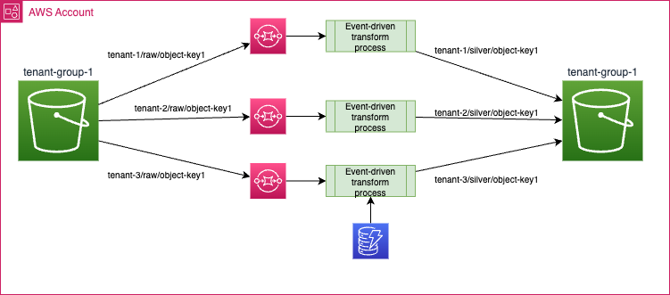
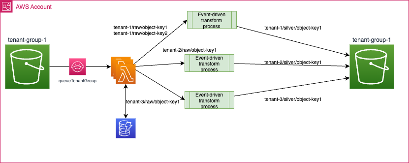
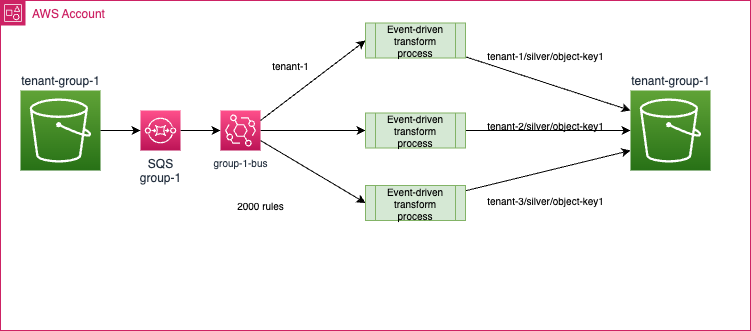

# Process S3 events for multi-tenant bucket

A study on how to best support S3 Event Notification processing using SQS or Event Bridge or a Streaming platform to address a multi-tenant use cases: files for a tenant are in grouping bucket.

## Requirements

This article is to mockup a SaaS multi-tenant application using S3 as Data Lake and asynchronous file processing at scale.

* Each bucket has top level prefixes assigned to a unique tenant. Within this we can have a hierachy of 'folders' and objects. It is a multi-tenancy segregation at the prefix level.

```
tenant-group-1 (bucket)
├── tenant_1
│   ├── raw
│   │   ├── object_10
│   │   └── object_11
│   └── silver
│   │   ├── object_20
│   │   └── object_21
├── tenant_2
└── tenant_3
```

* To control file upload a tool will take into account the tenant unique identifier to define the S3 object prefix.
* Need to support million of files uploaded to S3 per day, at a rate of 200k file moves per minute. Once a file is uploaded (in raw prefix), there are file processors that transform the file into another format (the demonstration in this repository, uses Iceberg) to save in another prefix (silver). The basic processing looks like in figure below:


**Diagram 1: Single tenant processing**

* The event-driven processor can directly get message from the SQS queue, using AWS SDK, or being a Apache Spark application using connector.
* The SaaS platform needs to support hundred of those event-driven processing in parallel. Each tenant has its own prefix within a bucket.
* SaaS AWS account is the owner of the buckets, the queues, or topics created in the event backbones used.

## Constraints and constructs

* An AWS account can have a maximum of 100 buckets per region per account. This is a soft limit with a max of 1000 after change request to AWS.
* There is no limit on the number of objects stored within a bucket. No limit in the number of prefixes. However, a spike in the request rate might cause throttling. In S3 partitions exist at the prefix level, and not at the object level. S3 doesn't use hierarchy to organize its objects and files. A folder is the value between the two slash (/) characters within the prefix name.
* S3 supports configuring event notifications on a per-bucket basis, to send events to other AWS services like AWS Lambda, SNS or SQS.
* To avoid looping, event notification needs to take into account prefixes. We could use another bucket for the target of the file processing, but to keep tenancy within the contraint of a unique bucket, prefixes are used.
* S3 storage class is Standard or S3 Express one Zone.
* Each S3 bucket can have up to 100 event notification configurations. A configuration defines the event types to send from S3 and what filters to apply to the event by using the prefix and suffix attributes of the S3 objects:

    

    With the potential target to get the event:

    

* Below is an example of [Python AWS CDK](https://docs.aws.amazon.com/cdk/api/v2/python/aws_cdk.aws_s3_notifications.html) code to define event notification configuration for ObjectCreated event on bucket `tenant-group-1`, prefix: `tenant-1`.

    ```python
    queue = sqs.Queue(self, 
                          'tenant-grp-1',
                          queue_name='tenant-grp-1',
                          retention_period=Duration.days(1),
                          encryption=sqs.QueueEncryption.UNENCRYPTED)

    bucket = s3.Bucket(self, "tenant-group-1",
                           bucket_name='tenant-group-1',
                           versioned=False,
                           removal_policy=RemovalPolicy.DESTROY,
                           auto_delete_objects=True)
    bucket.add_event_notification(s3.EventType.OBJECT_CREATED, 
                                s3n.SqsDestination(queue),
                                NotificationKeyFilter( prefix="tenant-1/raw")
                                )
    ```


* For demonstration purpose, we will process ObjectCreated events. See [the other supported notifications for SQS](https://docs.aws.amazon.com/AmazonS3/latest/userguide/notification-how-to-event-types-and-destinations.html#supported-notification-event-types) and [for the ones for EventBridge](https://docs.aws.amazon.com/AmazonS3/latest/userguide/EventBridge.html). Also CDK is quite static and works well with infrastructure as code and CI/CD practices. For this demonstration SDK may be a better solution to demonstrate the dynamicity of the SaaS platform.
* Event ordering: S3 to SQS FIFO is not supported. Event Notification includes a Sequencer attribute which can be used to determine the order of events for a given object key. Sequencer provides a way to determine the sequence of events. Notifications from events that create objects (PUTs) and delete objects contain a sequencer.


### Limits

* Number of bucket per region per account: 100
* S3 request performance: 3,500 PUT/COPY/POST/DELETE or 5,500 GET/HEAD requests per second per partitioned Amazon S3 prefix. So in this example will be per tenant.
* Number of S3 Event Notification: 1000 evt
* Number of SQS queue per region. No real limit.
* SQS is using at least once delivery.

### Event Content

The S3 [Event notification includes metadata](https://docs.aws.amazon.com/AmazonS3/latest/userguide/notification-content-structure.html) and information about the access on the bucket done and the object created (not all fields are reported in following json):  

```json
{
    "Records": [
        {
            "eventVersion": "2.1",
            "eventSource": "aws:s3",
            "awsRegion": "us-west-2",
            "eventTime": "2023-12-22T01:13:20.539Z",
            "eventName": "ObjectCreated:Put",
            "userIdentity": {
                "principalId": "..."
            },
            "s3": {
                "s3SchemaVersion": "1.0",
                "configurationId": ".....jU4",
                "bucket": {
                    "name": "s3sqsfanoutstack-tenantgroup1958dab46-bv3cwcddfgox",
                    "ownerIdentity": {
                        "principalId": "..."
                    },
                    "arn": "arn:aws:s3:::s3sqsfanoutstack-tenantgroup1958dab46-bv3cwcddfgox"
                },
                "object": {
                    "key": "raw/repors.csv",
                    "size": 20500,
                    "eTag": "1388e3face4eb9892960e366bd8b79aa",
                    "sequencer": "006584E2B074B0899D"
                }
            }
        }
    ]
}
```

Example of Python code to access the object's path,

```python
 for record in events["Records"]:
    bucket = record["s3"]["bucket"]
    objectName=record["s3"]["object"]["key"]
    print(bucket["name"]+"/"+objectName)
```

## Potential Architecture

In the diagram 1, we were using SQS queue to support the asynchronous event processing with persistence. As there will be multi-tenant per bucket, we need to fanout the processing per tenant.

### Defining a group of tenants

Here is an example of tenant group definition maps with one S3 bucket, and one unique queue:

```json
{
   "name": "tenant-group-1",
   "bucket": "<ACCOUNTID>-tenant-group-1",
   "region": "us-west-2",
   "queueURL": "https://sqs.us-west-2.amazonaws.com/ACCOUNTID/tenant-group-1",
   "queueArn": "arn:aws:sqs:us-west-2:ACCOUNTID:tenant-group-1",
   "status": "ACTIVE",
   "created-at": "2023-12-26 16:25:32",
   "updated-at": "2023-12-26 16:25:32"
}
```

See the code to [create tenant group](https://github.com/jbcodeforce/aws-messaging-study/blob/main/SQS/s3-sqs-fanout/createGroupTenant.py)

When onboarding a tenant, the platform defines a unique tenant_id, and links it to the target bucket and prefix within a persisted Hash Map. This will be used by the SaaS SDK to put the file in the good bucket / 'folder'.

```json
{
    "Name": {"S": "tenant-1"},
    "RootS3Bucket": {"S": "403993201276-tenant-group-1"}, 
    "Region": {"S": "us-west-2"}, 
    "Status": {"S": "ACTIVE"}, 
    "BasePrefix": {"S": "tenant-1/"}, 
    "GroupName": {"S": "tenant-group-1"}
}    
```

With this information we can try to use the different architectures.

### SQS only

The following approach illustrates the simplest asynchronous architecture, using different S3 event notifications based on prefixes and one queue per tenant.



* Using event notification definition, we can fanout at the level of the event notification definition, one SQS queue per tenant. Below is an example of code to create the S3 event notification dedicated per tenant:

    ```python
    def eventNotificationPerTenant(tenantName,bucketName,queueArn):
    response = s3.put_bucket_notification_configuration(
        Bucket=bucketName,
        NotificationConfiguration= {
            'QueueConfigurations': [
            {
                'QueueArn': queueArn,
                'Events': [
                    's3:ObjectCreated:*'|'s3:ObjectRemoved:*'|'s3:ObjectRestore:*'| 's3:Replication:*'
                ],
                'Filter': {
                    'Key': {
                        'FilterRules': [
                            {
                                'Name': 'prefix',
                                'Value': tenantName + "/"
                            },
                        ]
                    }
                }
            },
        ]})
    ```

* The queue ARN will be the queue per tenant.
* This approach will scale at the level of the number of event-notification that could be created by bucket.
* The negatives of this approach is the big number of queues and event-notification to be created when we need to scale at hundred of thousand tenants. Also there is no routing logic applied. The filtering on the file to process will be done by the event-driven transform process.

### S3 to Lambda to SQS

The more flexible implementation may use Lambda function as a target to S3 Event Notification, to support very flexible routing implementations. If the event-driven processing is exposed via HTTP the Lambda function may directly call the good HTTP endpoint.

{ width=750 }

Lambda can scale at thousand of instances in parallel. The solution uses one queue per bucket.

As an alternate if the processing needs to be asynchronous then we can add queues before the event-driven processors:

{ width=750 }

The Lambda function can be a target of the S3 event notification:

```python
def eventNotificationPerTenantViaLambda(tenantName,bucketName,functionArn):
    response = s3.put_bucket_notification_configuration(
        Bucket=bucketName,
        NotificationConfiguration= {
          'LambdaFunctionConfigurations': [
            {
                'LambdaFunctionArn': functionArn,
                'Events': [
                     's3:ObjectCreated:*'|'s3:ObjectRemoved:*'|'s3:ObjectRestore:*'| 's3:Replication:*'|'s3:LifecycleTransition'|'s3:IntelligentTiering'|'s3:ObjectAcl:Put'|'s3:LifecycleExpiration:*'|'s3:LifecycleExpiration:Delete'|'s3:LifecycleExpiration:DeleteMarkerCreated'|'s3:ObjectTagging:*',
                 ],
                'Filter': {
                    'Key': {
                        'FilterRules': [
                            {
                               'Name': 'prefix',
                                'Value': tenantName + "/"
                            },
                        ]
                    }
                }
            },
            ]
        },
        )
```

Obviously we can bypass the front end queue, and all the SQS queues if we want to be more synchronous. Except that the S3 Event notification will be posted to an internal queue in the Lambda service. But this queue is transparent to the developer. 

### SNS - SQS

In many Fanout use cases, one of the solution is to combine SNS with SQS. The S3 event notification target is now a SNS topic.


The SNS filtering defines the target SQS queue. The event-driven processes get their tenant based workload.

### SQS - Event Bridge

Event Bridge could be a solution if the file processing is exposed with HTTP endpoint. Routing rule will be used to select the target end-point depending of the tenant information. But there is a limit of 2000 rules per event buses, so it may not be a valid solution to address the use case of thousand of tenants.




### SQS - MSK

Finally Kafka may be a solution to stream the S3 event notification to it, via a queue. The interest will be to be able to replay the events.


It may be more complex to deploy as we need to define a MSK cluster, and Kafka Connect from SQS source connector. The Event-driven processes need to consume from Kafka. Event ordering will be kept. It will scale to hundred of consumers.

## Demonstration

