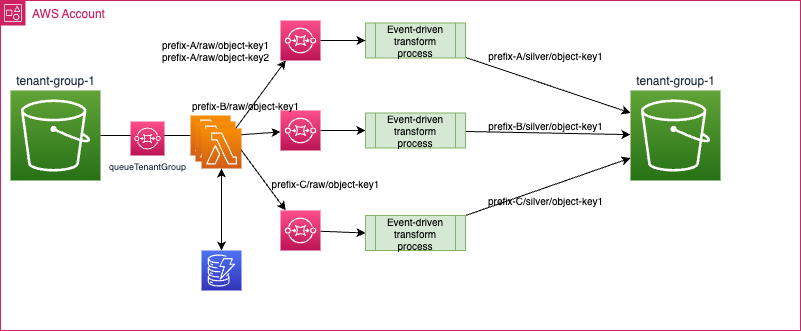

# Process S3 events for multi-tenant bucket with EDA

???+ Info
    **Created:** Dec 2023 - Updated: **01/26/24**. State: Draft

This study reviews, how to best support the Amazon S3 Event Notification processing, using an event-driven processing approach to help an software vendor computing the storage usage of its users in a multi-tenancy architecture.

As in any event-driven solution, the choice of implementation approaches will depend of the requirements (Confucius may have already said it), this article addresses a multi-tenancy use case,  for S3 notification event processing at scale.

I cover different messaging technologies like Amazon SQS, SNS, AWS Event Bridge or streaming platform like Kafka.

The goal is to help developers or solution architects review the possible solutions and select the most appropriate one to address their own problem. The problem is generic enough to represent a reusable solution.

## Introduction

The implementation demonstration in this [repository/folder](https://github.com/jbcodeforce/aws-messaging-study/tree/main/SQS/s3-event-processing) is to mockup a SaaS multi-tenant application using S3 as Data Lake and an asynchronous event-driven processing to address **S3 put or update object** event notifications with a goal to support 100k+ tenants.

Each bucket has top level prefixes assigned to a unique tenant. Within a prefix, user can have a hierarchy of 'folders' and objects. It is a multi-tenancy segregation pattern at the prefix level. The following figure illustrates a simple example of bucket and prefix per tenant organization:

```sh
tenant-group-1 (bucket)
├── tenant_1
│   ├── raw
│   │   ├── object_10
│   │   └── object_11
│   └── silver
│   │   ├── object_20
│   │   └── object_21
├── tenant_2
└── tenant_3
```

* To control file upload, a tool will take into account the tenant's unique identifier so the system can map the target S3 object prefix to a tenant.
* The solution needs to support million of files uploaded to S3 per day, at a rate of 200k file moves per minute. Once a file is uploaded (in `raw` prefix), there are file processors that transform the file into another format (the demonstration in this repository, uses Iceberg) to save in another prefix (`silver`). The basic processing, for a unique tenant, looks like in following figure:

{ width=900 }

**Figure 1: Single tenant processing**

* The event-driven processor can directly get messages from the SQS queue, using AWS SDK. It has to manage idempotency as S3 Event notification may generate retries, so delivering the same message multiple times.
* The SaaS platform needs to support hundred of those event-driven processing in parallel, at least one per tenant.
* The SaaS AWS account is the owner of the buckets, and any queues, or topics used for the solution.

### Constraints and constructs

* An AWS account can have a maximum of 100 buckets per region per account. This is a soft limit.
* There is no limit on the number of objects stored within a bucket. No limit in the number of prefixes. However, a spike in the API request (on create and update objects) rate might cause throttling. In S3, partitions exist at the prefix level, and not at the object level. S3 doesn't use hierarchy to organize its objects and files. A folder is the value between the two slash (/) characters within the prefix name.
* S3 supports configuring event notifications on a **per-bucket** basis, to send events to other AWS services like AWS Lambda, SNS or SQS.
* As the event-processing job will create new file in another prefix, to avoid looping, the event notification needs to take into account the prefixes. We could use another bucket for the target of the file processing, but to keep tenancy within the constraint of a unique bucket, prefixes are also used.
* The S3 storage class is `Standard` or `S3 Express one Zone`.
* Each S3 bucket can have up to 100 event notification configurations. A configuration defines the event types to send from S3 and what filters to apply to the event by using the prefix and suffix attributes of the S3 objects:

    

    **Figure 2: Defining S3 event notification in AWS Console**

    With the potential destination to publish the events to:

    

     **Figure 3: Destination for the events** 

* Below is an example of [Python AWS CDK](https://docs.aws.amazon.com/cdk/api/v2/python/aws_cdk.aws_s3_notifications.html) code to define event notification configuration for ObjectCreated event on bucket `tenant-group-1`, prefix: `tenant-1/raw`.

    ```python
    queue = sqs.Queue(self, 
                          'tenant-grp-1',
                          queue_name='tenant-grp-1',
                          retention_period=Duration.days(1),
                          encryption=sqs.QueueEncryption.UNENCRYPTED)

    bucket = s3.Bucket(self, "tenant-group-1",
                           bucket_name='tenant-group-1',
                           versioned=False,
                           removal_policy=RemovalPolicy.DESTROY,
                           auto_delete_objects=True)
    bucket.add_event_notification(s3.EventType.OBJECT_CREATED, 
                                s3n.SqsDestination(queue),
                                NotificationKeyFilter( prefix="tenant-1/raw")
                                )
    ```

* Notifications are asynchronous: S3 will queue events and will retry delivery if destinations are unavailable. This avoids blocking the caller.
* For demonstration purpose, we will process ObjectCreated events. See [the other supported notifications for SQS](https://docs.aws.amazon.com/AmazonS3/latest/userguide/notification-how-to-event-types-and-destinations.html#supported-notification-event-types) and [for the ones in EventBridge](https://docs.aws.amazon.com/AmazonS3/latest/userguide/EventBridge.html). Also CDK is quite static and works well with infrastructure as code and CI/CD practices. For this demonstration SDK may be a better solution to demonstrate the flexibility of the SaaS platform to add tenant dynamically: we can imagine a `create tenant` API that provisions a prefix and assigns it to an existing bucket dynamically.
* On rare occasion, S3 retry mechanism might cause duplicate S3 event notification.
* Event ordering: S3 event notification to SQS FIFO is not supported. Event Notification includes a Sequencer attribute which can be used to determine the order of events for a given object key. Sequencer provides a way to determine the sequence of events. Notifications from events that create objects (PUTs) and delete objects contain a sequencer.

### Limits

* Number of bucket per region per account: 100.
* S3 request performance: 3,500 PUT/COPY/POST/DELETE or 5,500 GET/HEAD requests per second per partitioned Amazon S3 prefix. So in this example, it will be per tenant. 200k file uploads per minute should create around 3350 events per second.
* Number of S3 Event Notification: 100 events.
* S3 event notifications do not natively support event batching.

### Event Content

The S3 [Event notification includes metadata](https://docs.aws.amazon.com/AmazonS3/latest/userguide/notification-content-structure.html) about the bucket access done and the object created (*not all fields are reported in following json*):  

```json
{
    "Records": [
        {
            "eventVersion": "2.1",
            "eventSource": "aws:s3",
            "awsRegion": "us-west-2",
            "eventTime": "2023-12-22T01:13:20.539Z",
            "eventName": "ObjectCreated:Put",
            "userIdentity": {
                "principalId": "..."
            },
            "s3": {
                "s3SchemaVersion": "1.0",
                "configurationId": ".....jU4",
                "bucket": {
                    "name": "tenant-group-1",
                    "ownerIdentity": {
                        "principalId": "..."
                    },
                    "arn": "arn:aws:s3:::tenantgroup1....ddfgox"
                },
                "object": {
                    "key": "raw/reports.csv",,
                    "eTag": "138....79aa",
                    "sequencer": "00....99D"
                }
            }
        }
    ]
}
```

Example of Python code to access the object's path,

```python
 for record in events["Records"]:
    bucket = record["s3"]["bucket"]
    objectName=record["s3"]["object"]["key"]
    print(bucket["name"]+"/"+objectName)
```

## Potential Solutions

In the figure 1 above, we were using SQS queue to support the asynchronous event processing with persistence. As there will be multi-tenant per bucket, we need to fan out the processing per tenant.

### Defining a group of tenants

Below is a simple tenant group definition for one S3 bucket and one unique queue:

```json
{
   "name": "tenant-group-1",
   "bucket": "<ACCOUNTID>-tenant-group-1",
   "region": "us-west-2",
   "queueURL": "https://sqs.us-west-2.amazonaws.com/ACCOUNTID/tenant-group-1",
   "queueArn": "arn:aws:sqs:us-west-2:ACCOUNTID:tenant-group-1",
   "status": "ACTIVE"
}
```

See the Python code to [create tenant group](https://github.com/jbcodeforce/aws-messaging-study/blob/main/SQS/s3-sqs-fanout/createGroupTenant.py) for demonstration purpose.

When onboarding a tenant, the platform defines a unique `tenant_id`, and links it to the target bucket and prefix within a persisted Hash Map. This will be used by the SaaS SDK to put the file in the good `bucket / 'folder'`. The following json may be persisted in DynamoDB.

```json
{
    "Name": {"S": "tenant-1"},
    "RootS3Bucket": {"S": "40....6-tenant-group-1"}, 
    "Region": {"S": "us-west-2"}, 
    "Status": {"S": "ACTIVE"}, 
    "BasePrefix": {"S": "tenant-1/"}, 
    "GroupName": {"S": "tenant-group-1"},
    "ProcessorURL": {"S": "https://"}
}    
```

### SQS only

The following approach illustrates the simplest asynchronous architecture, using different S3 event notifications based on prefixes and a unique queue per tenant.

{ width=900}

**Figure 5: S3 event notification to SQS tenant queue**

* There will be a limit of 100, S3 event notifications, per bucket. This seems to be a hard limit. Having 1000 bucket per account per region with 100 event notifications, should support around 100k tenants.
* Using event notification definition, we can fan-out at the level of the event notification definition, one SQS queue per tenant. Below is a code sample to create the S3 event notification to target a SQS queue, and dedicated per tenant via the prefix name:

    ```python
    def eventNotificationPerTenant(tenantName,bucketName,queueArn):
    response = s3.put_bucket_notification_configuration(
                Bucket=bucketName,
                NotificationConfiguration= {
                    'QueueConfigurations': [
                    {
                        'QueueArn': queueArn,
                        'Events': [
                            's3:ObjectCreated:*'|'s3:ObjectRemoved:*'|'s3:ObjectRestore:*'| 's3:Replication:*'
                        ],
                        'Filter': {
                            'Key': {
                                'FilterRules': [
                                    {
                                        'Name': 'prefix',
                                        'Value': tenantName + "/raw"
                                    },
                                ]
                            }
                        }
                    },
                ]})
    ```

* The queue ARN will be the queue per tenant.
* This approach will scale at the level of the number of event-notification that could be created per bucket.
* The negative of this approach is the big number of queues and event-notifications to be created when we need to scale at hundred of thousand tenants. The filtering on the file to process will be done by the `event-driven transform` process.

* There is no real limit to the number of SQS queue per region per account.
* Standard queues support a maximum of 120,000 inflight messages (received from the queue but not yet deleted by the consumer). 
* On [SQS Standard queue](https://aws.amazon.com/sqs/features/) nearly unlimited number of transactions per second per API action.
* SQS is using at least once delivery semantic.

### S3 to Lambda to SQS

A more flexible implementation may use Lambda function as a target to S3 Event Notification, to support flexible routing and filtering implementation, use the fan-out pattern, and support batching the events. If the event-driven processing is exposed via HTTP the Lambda function may directly call the good HTTP endpoint:

{ width=900 }

**Figure 6: Lambda to fanout to http endpoints**

Lambda can scale at thousand of instances in parallel. The solution uses one queue per bucket and one S3 event notification definition.

When the event-driven processing needs to be asynchronous, then we can add one queue before each event-driven process and the Lambda will send the event to the good queue.

{ width=900 }

**Figure 7: Lambda to fan out to SQS queues**

???- Info "Lambda as a destination to S3 Event Notification"
    The Lambda function can be a target of the S3 event notification as illustrated below:

    ```python
    def eventNotificationPerTenantViaLambda(tenantName,bucketName,functionArn):
        response = s3.put_bucket_notification_configuration(
            Bucket=bucketName,
            NotificationConfiguration= {
            'LambdaFunctionConfigurations': [
                {
                    'LambdaFunctionArn': functionArn,
                    'Events': [
                        's3:ObjectCreated:*'|'s3:ObjectRemoved:*'|'s3:ObjectRestore:*'| 's3:Replication:*'|'s3:LifecycleTransition'|'s3:IntelligentTiering'|'s3:ObjectAcl:Put'|'s3:LifecycleExpiration:*'|'s3:LifecycleExpiration:Delete'|'s3:LifecycleExpiration:DeleteMarkerCreated'|'s3:ObjectTagging:*',
                    ],
                    'Filter': {
                        'Key': {
                            'FilterRules': [
                                {
                                'Name': 'prefix',
                                    'Value': tenantName + "/raw"
                                },
                            ]
                        }
                    }
                },
                ]
            },
            )
    ```

    Except that the S3 Event notification is posted to an internal queue in the Lambda service. But this queue is transparent to the developer.

For the Lambda routing implementation, Lambda will automatically deletes the message from the queue if it returns a success status.

The pricing model is pay per call, duration and memory used.

See a proof of concept implementation of the following deployment:

{ width=900}

with demonstration script in [this folder](https://github.com/jbcodeforce/aws-messaging-study/tree/main/SQS/s3-event-processing).

### SNS - SQS

In many Fan-out use cases, one of the solution is to combine SNS with SQS. The S3 event notification target is now a SNS topic.  S3 Event notifications are pushed once in a SNS Service, and the SQS queues are subscribers to the topic and then get the messages.


The advantages:

* Fully decoupled with no data loss as SQS will always listen to SNS topic.
* SQS adds data persistence, delayed processing and retries of work.
* Increase the number of subscriber over time.
* Can use Message Filtering using a JSON policy. But there are limits on the number of subscription filter policies: 200 per topic.
* Can be used for cross-region delivery, with a SQS queue in another region.

The disadvantages:

* There is a limit on the number of filter policies. The solution is to add filtering logic within a Lambda function, which will only be relevant if there are other subscribers to the SNS topic for other type of event processing, like analytics. If there is no other consumer then the S3-> SQS -> Lambda -> SQS solution may be more appropriate.

{ width=900}


### SQS - Event Bridge

Event Bridge could be a solution if the S3 event processing is exposed with HTTP endpoint. Routing rule will be used to select the target end-point depending of the tenant information. But there is a limit of 2000 rules per event bus, so it may not be a valid solution to address the use case of thousand of tenants.

{ width=900}

Also S3 Event Notifications can be sent to the default event bus only, we may need different buses.

### SQS - MSK

Finally Kafka may be a solution to stream the S3 event notification to it, via a SQS queue. The interest of this solution, will be to enable event replay and really embrace an event-driven architecture where any consumers may come to consume messages and use an event-sourcing pattern.

{ width=900}

It may be more complex to deploy as we need to define a MSK cluster, and Kafka Connect - SQS source connector. The Event-driven processes need to consume from Kafka. Event ordering will be kept. It will scale to thousand of consumers. This will be a recommended approach when such events are becoming events that can be consumed by many different consumers.

## Conclusion

For a cost perspective, scale to zero is very important, as the solution deployment does not need to get computers waiting for events to come. The Lambda with SQS queues seems the most appropriate method to address the multi-tenant at scale requirements of this solution. As an alternate approach, using a long term strategy of doing an event-driven architecture then Kafka based solution will be a better choice. 

## Sources of information

* [Product documentation - Amazon S3 Event Notifications](https://docs.aws.amazon.com/AmazonS3/latest/userguide/EventNotifications.html)
* [Manage event ordering and duplicate events with Amazon S3 Event Notifications - blog](https://aws.amazon.com/blogs/storage/manage-event-ordering-and-duplicate-events-with-amazon-s3-event-notifications/)
* [Getting visibility into storage usage in multi-tenant Amazon S3 buckets](https://aws.amazon.com/blogs/storage/getting-visibility-into-storage-usage-in-multi-tenant-amazon-s3-buckets/)

## Project Status

01/2024:

* [x] Python SDK to create a tenant group with one matching SQS queue. Define S3 Event Notification from the bucket to SQS. Keep information of the tenant group in DynamoDB.
* [x] Python SDK to create a new tenant within a given group: create a prefix under the bucket for raw and silver prefixes. Create a SQS per tenant. Persist information about a tenant in DynamoDB.
* [x] Python SDK app to write a file to S3 bucket for a tenant.
* [ ] From the tenant_group SQS queue to Lambda event routing function to SQS using SAM

* [ ] S3 event notifications to SNS to Lambda to SQS using SAM
* [x] CDK to create S3 bucket `tenant-grp-2` and Event notification to SNS topic `tenant-grp-2`