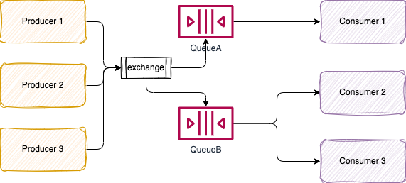
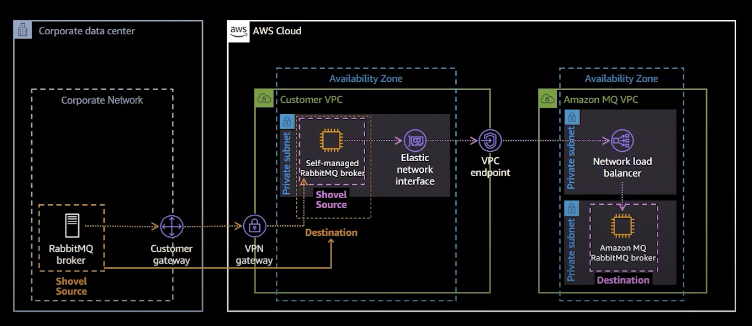
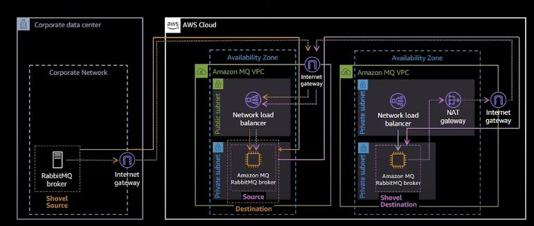

# Rabbit MQ

[RabbitMQ](https://www.rabbitmq.com/) is an OOS message broker with highly flexible **routing** capability.

Some Rabbit MQ important concepts:

* **Exchanges**: take a message and route it into zero or more queues or other exchanges. The supported types are `Direct, Topic, Fanout (like a pub/sub), Headers`. Exchanges are routing rules.
* **Bindings**: rules used by exchanges to route messages to queues.
* **Queues**: store messages. Single instance broker uses EBS as local storage.



Some key characteristics:

* RabbitMQ sends acknowledgements to publishers on message receipt
* Consumers maintain persistent TCP connections with RabbitMQ and declare which queue(s) they consume. Messages are pushed to consumers.
* Consumers send acknowledgements of success/failure.
* Messages are removed from queues once consumed successfully.
* We can have competing consumers to scale the message processing
* RabbitMQ offers "at most once delivery" and "at least once delivery"
* Consumer can configure a prefetch limit to avoid falling behind when producers send message faster than can be consumed.
* `Direct` exchanges route messages to queues/exchanges that have a Binding Key that exactly matches the routing key.
* `Header` exchanges route messages according to those header values.
* `Consistent Hashing` exchange that hashes either the routing key or a message header and routes to one queue only. This is used for order guarantees with scaled out consumers.
* The publisher can set the lifetime of the message and also the queue can have a message TTL.
* Exchanges and queues can be dynamically created and given auto delete characteristics. It is used for ephermal reply queues.
* RabbitMQ offers a set of plugins (consisten hashing exchange, STOMP, MQTT, web hooks, SMTP,...). For example the Management Plug-In that provides an HTTP server, with web UI and REST API.
* RabbitMQ offers Single Active Consumer (SAC) which prevents more than one consumer actively consuming a queue at the same time. So to cover scaling out and message ordering use the Consistent Hash Exchange and manually implement the consumer group logic of Kafka ourselves by using Single Active Consumer and custom hand-rolled logic.


* [See sample example in labs/messaging/rabbitmq](https://github.com/jbcodeforce/aws-studies/tree/main/labs/messaging/rabbitmq)
* [Summary from this article](https://jack-vanlightly.com/blog/2017/12/4/rabbitmq-vs-kafka-part-1-messaging-topologies)

#### Hybrid Cloud with Rabbit MQ

The classical needs are to move existing messaging solution running on-premises to cloud. Move the management to AWS will bring the operational responsability to AWS (product upgrage, infrastructure management). 

* Easy to describe the cluster configuration using code, with cloud formation for ex. From single instance or three-node, clustered broker.
* Encryption in transit over TLS and at rest with KMS keys.
* Supports ActiveMQ, Rabbit MQ, AMQP.

When moving from a single node to clustered there are some items to consider:

* Amazon MQ mirror queue configuration on nodes.
* Node replacement is done automatically. Consumers are disconnected and must reconnect. Queues automatically synchronize when a new mirror joins.
* Queue synchronization is a blocking operation per queue
* Keep queue size small by consuming messages quickly to minimize synchronization time.
* Public access to the broker: facade with a NLB. In private VPC, use VPC endpoint to NLB. NLBs are per AZ, so in a 3 node cluster, we have 3 NLBs.
* For migration there are two plugins that can be used: 

    * Federation plugin: downstream brokers initiate one-way, point-to-point connections to upstream brokers. Federated queues move messages from upstream queues to perform load balancing across downstream consumers. Fedreated exchanges copy messages from upstream exchanges to downstream ones, using connected topologies such as pairing, graphs, and fan-out.
    * Shovel plugin: the approach is to consume from source broker's queue and move message to a queue or exchange on a destination broker. It supports flexible topology but does not detect loop.

Below is a figure to illustrate an architecture to migrate from on-premises broker (without public access) to AWS managed cluster using Shovel plugin.

{ width=900 }

The same approach with a public access at the source level:

{ width=900 }


Here is a set of AWS CLI commands to get information of the brokers:

```sh
# change the name of the broker if needed
brokerId=$(aws mq list-brokers | jq '.BrokerSummaries[] | select(.BrokerName=="demo-jb") | {id:.BrokerId}' | grep "id" | cut -d '"' -f4)
url=$(aws mq describe-broker --broker-id=$brokerId | jq '.BrokerInstances[].Endpoints[0]' | xargs -n 2 | awk '{ print "failover:("$1","$2")" }')
userPassword=$(aws ssm get-parameter --name "MQBrokerUserPassword" |& grep "Value\|ParameterNotFound")
```


