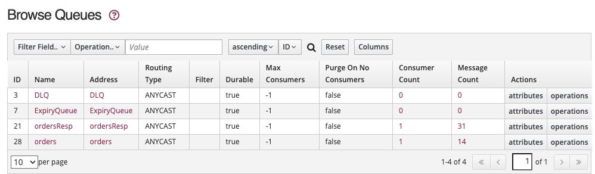

# Active MQ Artemis - JMS based request-replyTo demonstration

The application is the same as the classic implementation as described in [this note](./labs/classic-req-reply-jms.md), except, it uses the Artemis release with Jakarta JMS 3.0 API. This is not supported in Amazon MQ as of now.

## Running Locally

While in development mode, under the [artemis/request-replyto](https://github.com/jbcodeforce/aws-messaging-study/tree/main/artemis) folder:

1. Start Active MQ: ` docker compose up -d`
1. Start each application with `quarkus dev`

    ```sh
    cd jms-orchestrator
    quarkus dev
    cd jms-participant
    quarkus dev
    ```

1. Orchestrator Application URL: [http://localhost:8081/](http://localhost:8081/) and swagger-ui
1. See ActiveMQ console: [http://localhost:8161/](http://localhost:8161/), admin/adminpassw0rd


## Demonstration scripts

1. Post new order using the exposed API by going under `request-replyto/e2e` folder:

    ```sh
    cd request-replyto/e2e
    ./postOrder.sh
    ```

1. In the Orchestrator trace we should see  the following message, from the Resource API, then getting the response from the participant of the order process as the status for order changed from `pending` to `assigned`

    ```sh
    processing new order: { "sku": P05,"price": 100.0,"quantity": 2,"status": pending }
    17:34:32 INFO  [or.ac.or.in.re.OrderRepositoryMem] (executor-thread-1) Save in repository 7cfef528
    17:34:32 INFO  [or.ac.or.in.ms.OrderMessageProcessing] (Thread-2 (ActiveMQ-client-global-threads)) Received message: b1c0191f-4533-44f9-b56d-18ec67baa1fc,7cfef528,P05,100.0,2,assigned
    ```

1. On the participant side the log looks like:

    ```sh
    Received message: b1c0191f-4533-44f9-b56d-18ec67baa1fc,7cfef528,P05,100.0,2,pending
    17:34:32 INFO  [or.ac.pa.in.ms.OrderMessageConsumer] (Thread-1 (ActiveMQ-client-global-threads)) Reponse sent to replyTo queue {"messageID":"b1c0191f-4533-44f9-b56d-18ec67baa1fc","orderID":"7cfef528","sku":"P05","price":100.0,"quantity":2,"status":"assigned"}
    ```

1. We can see the state of the queues in the ActiveMQ Console

    


## Code Explanation

The code is under [jms-orchestrator](https://github.com/jbcodeforce/aws-messaging-study/tree/main/amazonMQ/activeMQ/classic/request-replyto/jms-orchestrator) and [jms-participant](https://github.com/jbcodeforce/aws-messaging-study/tree/main/amazonMQ/activeMQ/classic/request-replyto/jms-participant), to implement a request-response over queue using JMS.

The Orchestrator is a classical microservice with the order entity as resource. The interesting part is the `OrderMessageProcessing` class. It is JMS implementation code, using one connection to the broker and two JMS sessions, one for the producer and one for the consumer.

```java
connectionFactory = new ActiveMQConnectionFactory(connectionURLs);
connection = connectionFactory.createConnection(user, password);
connection.setClientID("p-" + System.currentTimeMillis());

initProducer();
initConsumer();
connection.start();    
```

As the class is MessageListener, the JMSconsumer thread is associate to it, and the `OrderMessageProcessing` class processes the replyTo queue messages in the onMessage method.

```java
 public void onMessage(Message msg) {
       TextMessage rawMsg = (TextMessage) msg;
       OrderMessage om;
        try {
            om = mapper.readValue(rawMsg.getText(),OrderMessage.class);
            logger.info("Received message: " + om.toString());
            Order o = OrderMessage.toOrder(om);
            service.processParticipantResponse(o);
            msg.acknowledge();
        }
        catch (JsonProcessingException | JMSException e) {
            e.printStackTrace();
        }
    }
```

Two implementation practices: having a different data model for the message than the business entity, and use the service class to implement the business logic.

On the consumer side, the class is also a MessageListener, but also a producer to the different queue.
Each consumer performs acknowledgement by code. Acknowledging a consumed message automatically acknowledges the receipt of all messages that have been consumed by the current session.


