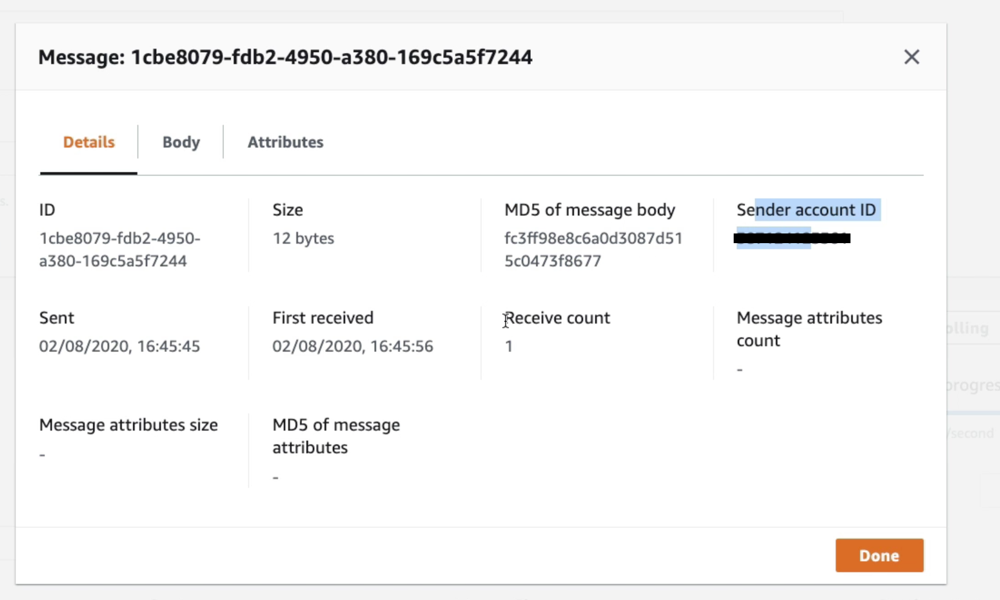

# [SQS: Standard queue](https://docs.aws.amazon.com/AWSSimpleQueueService/latest/SQSDeveloperGuide/welcome.html)

???- info "Document information"
    Created Oct 2022 - Updated 02/2024

???- info "Amazon SQS elevator pitch"
    Amazon SQS is a fully managed message queuing service that enables you to decouple and scale microservices, distributed systems, and serverless applications. Amazon SQS eliminates the complexity and overhead associated with managing and operating message-oriented middleware and empowers developers to focus on differentiating work. Using Amazon SQS, you can send, store, and receive messages between software components at any volume, without losing messages or requiring other services to be available.

## Basic concepts

* Oldest queueing service on AWS. Full managed service.
* Unlimited throughput and unlimited number of message in queue.
* The default retention is 4 days up to 14 days. low latency < 10ms. 
* Max message size is 256KB. Can be configured at the queue level. If messages are > 256k, use the claim-check pattern using S3 bucket.
* By default duplicate message is possible (at least once delivery) and out of order too (best effort).
* Consumer deletes the message.
* Supports automatic scaling.
* Max delay is 15 minutes
* Max queue size is 120k for standard and 20k for FIFO.
* SQS can be used as a write buffer for DynamoDB using a Lambda or other app to do the write.
* [See serverlessland patterns](https://serverlessland.com/search?search=SQS)

Specific SDK to integrate to `SendMessage`, `GetMessage`...

Consumers receive, process and then delete the messages. Parallelism is possible. The consumers can be in an auto scaling group (ASG) and with CloudWatch, it is possible to monitor the queue size / # of instances and in the CloudWatch alarm action, triggers EC2 scaling. 

{ width=500 }

**Figure 1: Auto scaling with  CloudWatch**

Message has metadata out of the box. After a message is polled by a consumer, it becomes invisible to other consumers.

 { width=600 }

**Figure 2: Messsage over SQS Metadata**

## Fan-out pattern

When we need to send the same message to more than one SQS consumer, we need to combine SNS and SQS: message is sent to the SNS topic and then "fan-out" to multiple SQS queues. It's fully decoupled, no data loss, and we have the ability to add more SQS queues (more applications) over time.

This is the pattern to use if consumer may be down for a long period: solution based on SNS only, will make some messages not processed and lost.

### [Visibility timeout](https://docs.aws.amazon.com/AWSSimpleQueueService/latest/SQSDeveloperGuide/sqs-visibility-timeout.html)

By default, the “message visibility timeout” is 30 seconds, which means the message has 30 seconds to be processed (Amazon SQS prevents other consumers from receiving and processing the message). If a consumer fails to process a message within the Visibility Timeout, the message goes back to the queue.

{ width=700 }

**Figure 3: SQS message visibility**

After the message visibility timeout is over, the message is “visible” in SQS, therefore the message may be processed twice. But a consumer could call the `ChangeMessageVisibility` API to get more time to process. When the visibility timeout is high (hours), and the consumer crashes then the re-processing of all the messages will take time. If it is set too low (seconds), we may get duplicates.

To reduce the number of API call to request message (improve latency and app performance), consumer can use the `long polling` API and wait for message arrival. 

When processing SQS messages in batches, if one of those messages cannot be processed, the consumer needs to handle the failure and returns a partial batch response, so only failed messages will be re-processed.  [See best practices for batch handling](https://docs.aws.amazon.com/prescriptive-guidance/latest/lambda-event-filtering-partial-batch-responses-for-sqs/best-practices-partial-batch-responses.html).

If you do not handle the error and just raise an exception on Lambda side, the whole batch will be reprocessed, including successfully processed messages.

### SQS Dead Letter Queue

We can set a threshold for how many times a message can go back to the queue.

After the `MaximumReceives` threshold is exceeded, the message goes into a dead letter queue (DLQ) (which has a limit of 14 days to process).

 { width=600 }

 **Figure 4: Dead letter queue configuration**

Delay queues let us postpone the delivery of new messages to a queue for a number of seconds. If we create a delay queue, any messages that we send to the queue remain invisible to consumers for the duration of the delay period. The default (minimum) delay for a queue is 0 seconds. The maximum is 15 minutes.

See [redrive back to source](https://docs.aws.amazon.com/AWSSimpleQueueService/latest/SQSDeveloperGuide/sqs-configure-dead-letter-queue-redrive.html)
to get the message back from the DLQ to the source queue (once the consumer application code is modified for example).

### SQS FIFO Queue

Queue can be set as FIFO to guaranty the order: limited to throughput at 300 msg/s without batching or 3000 msg/s with batching. It can also support [exactly once delivery](https://docs.aws.amazon.com/AWSSimpleQueueService/latest/SQSDeveloperGuide/FIFO-queues-exactly-once-processing.html). While configuring the FIFO queue a parameter (ContentBasedDeduplication) can be set to remove duplicate by looking at the content: Every message must have a unique `MessageDeduplicationId`.

*The name of the queue has to end with `.fifo`*.

If we don't use a Group ID, messages are consumed in the order they are sent, with only one consumer. But using Group ID, we can have as many consumers as there is groups. It looks like partition key in kinesis data streams.
Each consumer will get ordered records.

### Security

For security, there is encryption in flight via HTTPS, and at rest with KMS keys. SQS API access control via IAM policies, and SQS Access Policies for cross-account access and for other AWS services to access SQS.

It comes with monitoring.

### Sample Code

* [Python boto3 SQS](https://boto3.amazonaws.com/v1/documentation/api/latest/guide/sqs.html)
* [See consumerSQS and produceSQS in Python study / aws folder](https://github.com/jbcodeforce/python-code)